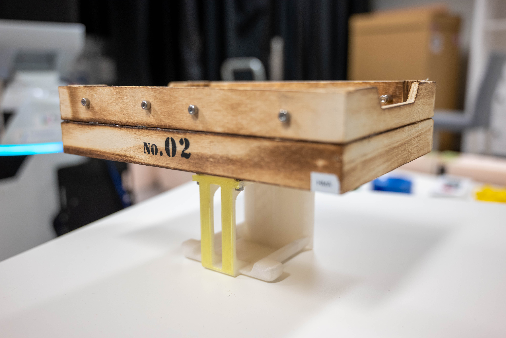
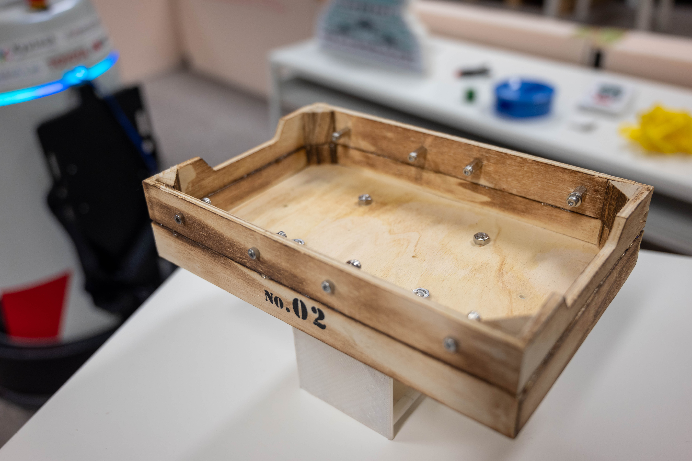

**現在ルール策定中ですので，今後変更となる可能性があります．**

# Restaurant
このタスクでは，ロボットはレストランのウエイターとして働く．ロボットは未知環境内で，クライアントからオーダーを取り，配膳する．

## メインゴール
クライアントからオーダーを取り，配膳する．

## フォーカス
このタスクでは，タスクプランニング，オンラインマッピング，未知環境でのナビゲーション，ジェスチャー検出，言葉による対話，マニピュレーションに焦点を当てる．

## セットアップ
- ロケーション: 現実のレストラン環境か，それに近い未知環境が用意される．本タスクではアリーナはそのまま使われない．
- スタートロケーション: ロボットはキッチンバーの側からスタートする．
- クライアント: プロフェッショナルクライアント（チームメンバーでない人間）が着席するテーブルが少なくとも3つ用意され，少なくとも2つのオーダーが実施される（例えば3つのオブジェクトを含むオーダーが1回と，2つのオブジェクトを含むオーダーが1回）．
- キッチンバー: レストランのキッチン（または，そのように定義される場所）の近くにテーブルが用意され，バーカウンターとして使用される．
- バーマン: プロフェッショナルバーマン（チームメンバーでない人間）が，キッチンバーの反対側でロボットを待つ．彼の役割はロボットに指示を出したり，ロボットが取ったオーダーに従ってオブジェクトを用意することである．
- オブジェクト: オーダーされたオブジェクトを含む複数のオブジェクトがキッチンバーに並べられる．

## シナリオ
- 競技時間：競技時間は最大15分である．
- 対話の使用言語は英語である．

### a. スタートフェーズ
1. 配置: レフェリーは，チームにロボットをスタートロケーションへ移動させるよう指示する．
1. スタート: レフェリーはスタートの合図を出し，タイマーをスタートさせる．同時にチームは最後の簡単なセットアップ（スタートボタンを押す等）を完了し，エリアを離れる．この際，ボタンを2つ以上押すなど複雑なセットアップ手順の実施は認められない．また，これ以後チームがロボットに触れると即座に失格になる．

### b. オーダーフェーズ
オーダーフェーズ，デリバリーフェーズは2回繰り返される．すなわちロボットは2回，オーダーを取り配膳することができる．
1. クライアントが手を降り，ウエイターを呼ぶ．ロボットは自身が呼ばれていることに気付かなくてはならない．
1. ロボットは呼ばれていることに気が付くと，バーマンにその旨を伝え，自身がオーダーを取りに行って良いか確認しなくてはならない．許可された場合は3へ，許可されなかった場合は1へ戻る．
1. ロボットは自身を呼ぶクライアントの元へ移動する．
1. ロボットはクライアントからオーダーを取る．オーダーされるオブジェクトの最大数は3である．この時，ロボットは自身が覚えた注文内容を発話して「正しくオーダーが取れたこと」を示さなければならない．
1. ロボットはキッチンバーに移動し，バーマンにオーダーを伝える．

### c. デリバリーフェーズ
1. ロボットはキッチンバーに置かれている複数のオブジェクトから，オーダーされたオブジェクトを把持する．ロボットはカスタムコンテナを使用することが許可される．
1. ロボットはクライアントの元へ移動する．
1. ロボットはオブジェクトをクライアントへ配膳する．この時，ロボットがクライアントのテーブルへオブジェクトを置かなければペナルティとなる．
1. ロボットはバーマンの元へ戻る．1回目の場合「b. オーダーフェーズ」へ戻る．2回目の場合，ここでタスクは終了する．

## カスタムコンテナ
ロボットはオブジェクトを配膳するために，チームが用意したカスタムコンテナを使用できる．

<table>
<tr>
  <td>
    
  </td>
  <td>
    
  </td>
  <td>
    
  </td>
</tr>
<tr>
  <td colspan="3">
  

   カスタムコンテナの一例（左，中：カスタムコンテナ本体，右：HSRがカスタムコンテナを持つ様子）
  

  </td>
</tr>
</table>

## デウスエクスマキナ
本タスクでは，次のデウスエクスマキナが採用される．デウスエクスマキナでは該当アクションの点数は入らないが，より簡単な手法でアクションをスキップし，タスクを継続することができる．

| Action | Bypassing |
| --- | --- |
| 手を振るクライアントを検出する | ✓ クライアントにARマーカーを持たせる   ✓ バーマンがクライアントを指さす |
| オーダーを取るためにクライアントのテーブルまで移動する | ✓ バーマンがテーブルまで歩いていく（ロボットはバーマンに追従する）   ✓ バーマンがロボットの手を引く |
| 正しくオーダーを取る | ✓ QRコードにより注文を伝える |
| オーダーを伝えるためにバーマンの元へ戻る | （オーダーを取るためにクライアントのテーブルまで移動する）と同じ |
| オーダーされたオブジェクトを把持する・獲得する | ✓ バーマンがカスタムコンテナに物体を乗せる |
| オブジェクトをデリバリーするためにクライアントのテーブルへ到達する | （オーダーを取るためにクライアントのテーブルまで移動する）と同じ |

## スコアシート
| Action | Score |
| --- | --- |
| 手を振るクライアントを検出する | 100×2 |
| オーダーを取るためにクライアントのテーブルまで移動する | 100×2 (*1) |
| 正しくオーダーを取る | 100×2 (*2) |
| オーダーを伝えるためにバーマンの元へ戻る | 100×2 (*3) |
| バーマンに正しくオーダーを伝える | 100×2 |
| オーダーされたオブジェクトを把持する・獲得する | 100×2 (*4) |
| オブジェクトをデリバリーするためにクライアントのテーブルへ到達する | 100×2 (*4) |
| クライアントへオブジェクトを配達する | 100×2 (*2, 4) |
| *ペナルティ* | 　 |
| オーダーを取る際にクライアントの方向を向いていない | (*5) |
| オブジェクト配達時，ロボットがオブジェクトをテーブルに置いていない | -50×2 |

### 採点時の注意
- *1: 目的地に到達完了したときにスコアが与えられる．到達完了は椅子に座ったクライアントが手を伸ばしてロボットに届く距離に到達した場合と定義する．
- *2: ロボットがクライアントとインタラクションをするときに椅子から離れるように指示することができる．クライアントが指示を理解し椅子から離れてインタラクションが成立したとき，当該スコアに0.5を乗ずる．
- *3: 目的地に到達完了したときにスコアが与えられる．到達完了はバーマンがデフォルト位置から立った状態で手を伸ばしてロボットに届く距離に到達した場合と定義する．
- *4: オーダーされたオブジェクトIDリストと実際に操作したオブジェクトIDリストのハミング（レーベンシュタイン）距離をDとしたとき，当該スコアに(0.5^D)を乗ずる．
  - 実際に操作したオブジェクトが0個のときはスコアは0とする
  - 例えばオーダーがA and Bで，Aのオブジェクトを1つ操作したとき，"AB"と"A0"のハミング距離を計算しD=1とする
  - 例えばオーダーがA and Bで，Aのオブジェクトを2つ操作したとき，"AB"と"AA"のハミング距離を計算しD=1とする
  - 例えばオーダーがA and Bで，Aのオブジェクトを2つ，Bのオブジェクト2つを操作したとき，"AB00"と"ABAB"のハミング距離を計算しD=2とする
- *5: 正しくオーダーを取るのスコアに0.5を乗ずる．オーダーを取るタイミングはクライアントとの会話（椅子から離れるように指示することも含む）が始まった瞬間と定義する．
