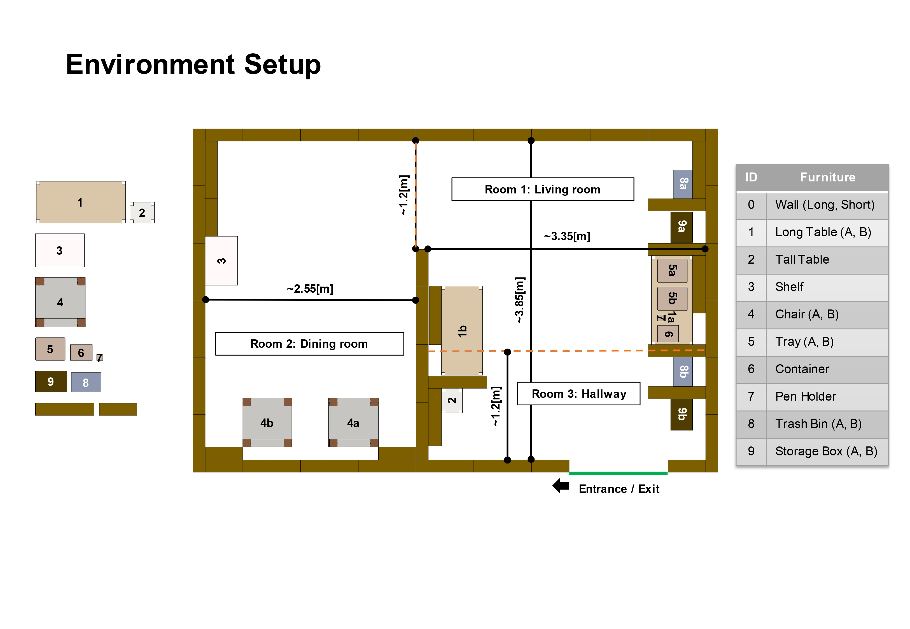
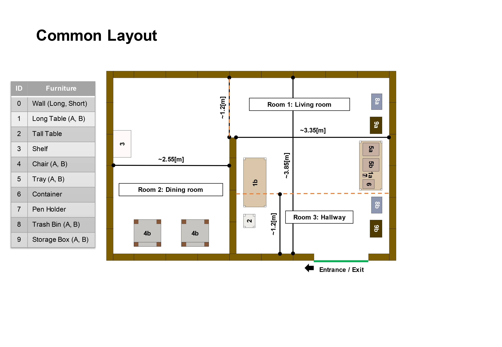
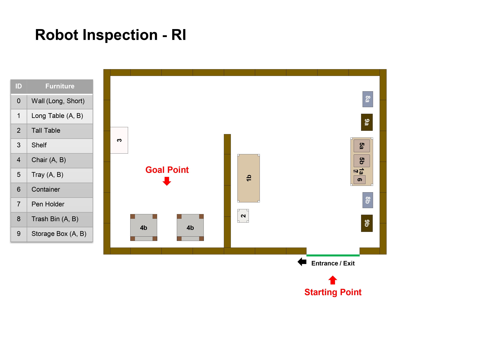
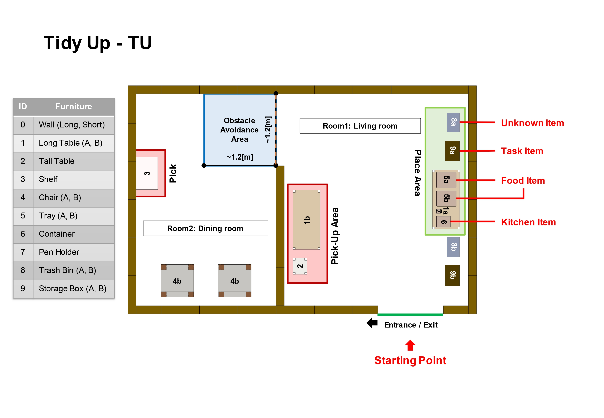
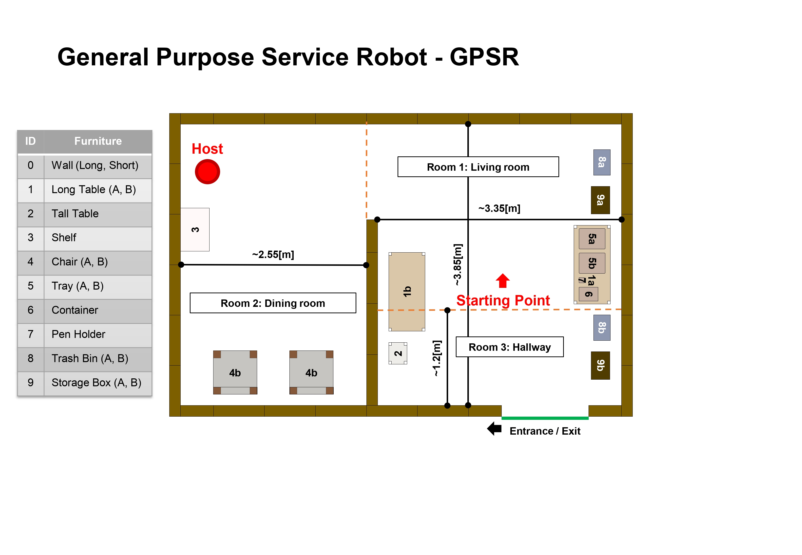
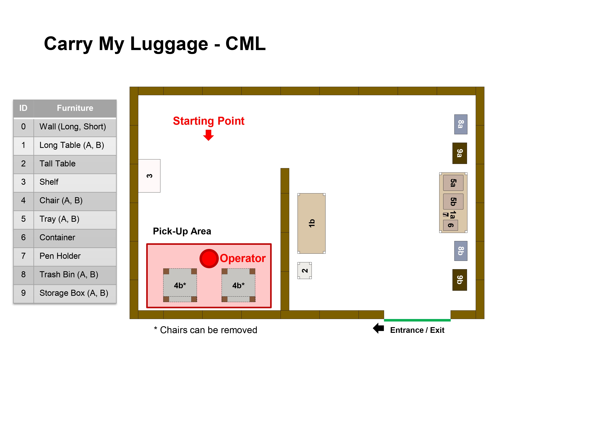
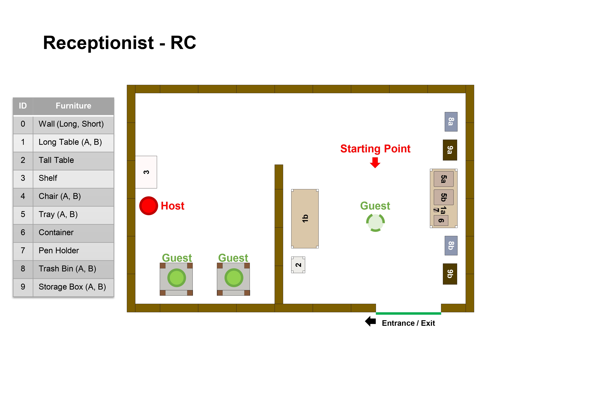

[Go back to README](../../../README_en.md)

# Layout List

> [!WARNING]
> Layout dimensions may differ from the original *Arena*.

## Environment Setup

## Common Layout

## Common Layout (Furniture only)​

-layout.jpg)

## Common Layout (Wall only)​

-layout.jpg)

## Robot Inspection - RI ​

## Tidy Up - TU​

## General Purpose Service Robot - GPSR​

## Carry My Luggage - CML​

> ![IMPORTANT]
> Teams can decide whether to use the chairs, or place the bags in the floor.

> ![IMPORTANT]
> バッグを椅子を使わないで床に置くか，椅子の上に置くか，自由に決められる.

## Receptionist - RC​

