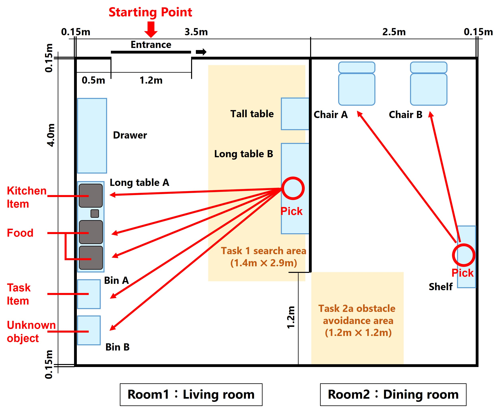

[READMEへ](../../README.md)

[日本語](./tu_ja.md) | [English](./tu_en.md)

# TidyUp for OPL

参考動画：https://youtu.be/sVmFMCnJf8s

> [!NOTE]  
> この動画は過去に実施された参考動画である．今年度とはルールが異なるため注意すること．

## メインゴール

このタスクでは，ロボットが散らかった部屋の片付けをすることを想定している．事前に物体をどこに片付けるかが指定されているため，ロボットはその情報をもとに所定の場所に片付けていく．その後，別の部屋へ移動し，手を振っている（もしくは，手を上げている）人に，棚から事前に指定された物を提供していく．[WRS（World Robot Summit）2020](https://wrs.nedo.go.jp/wrs2020/challenge/download/Rules/DetailedRules_Partner_EN.pdf)で行われた競技をRoboCup JapanOpen @Home OPL用にアレンジした競技になっている．

**制限時間**：20分（タスク１：15分，タスク２：5分）

## テクニカルフォーカス

このタスクは，既知環境での自律移動，物体認識，物体把持，タスクプランニングなどに焦点を当てている．

## セットアップ

- **ロケーション**：家庭環境を模したアリーナ環境が用いられる．特に競技はリビングルームで行われる．アリーナ内は事前にマッピングすることが可能とする（既知環境）．
- **スタートロケーション**：ロボットは，アリーナの外から`ドアオープン`（扉を開くこと）よりスタートする．
- **ゲスト**：2人のゲストは椅子に座っており，そのうち手を挙げている1人がロボットから物体を受け取る．

## シナリオ

### スタートフェーズ

1. **配置**：レフェリーは，チームにロボットをスタート位置へ移動させるよう指示する．また，チームメンバーはレフェリーからの指示通りに，使用する物体を配置する．配置する物体数は最大で10個である．
1. **スタート**：レフェリーはスタートの合図を出し，タイマーをスタートさせる．同時にチームは最後の簡単なセットアップ（スタートボタンを押す等）を完了し，エリアを離れる．このとき，ボタンを2つ以上押すなど複雑なセットアップ手順の実施は認められない．
1. **ドアオープン**：チームの1人はスタートの合図と同時にドアを開ける．このとき，ロボットはドアが開いたことを認識し，自律的にアリーナへ入場する．

### タスク１：片付けフェーズ

1. **競技時間**：`片付けフェーズ`（タスク１）の競技時間は**15分間**である．
2. **片付け**：ドアオープン後，ロボットはテーブル（`Long Table B`）の上に並べられた物体を全て片付ける．家庭環境には，既知と未知の物体が混同して設置されている．それぞれの物体にはカテゴリがあり，それぞれで片付ける場所（`Long Table A`, `Bin A`, `Bin B`）が決まっている．これらは事前に指定されているので，ロボットはそれをもとに物体を片付ける．
<!-- 家具名を要検討 -->

### タスク２：デリバリーフェーズ

1. **競技時間**：`デリバリーフェーズ`（タスク２）の競技時間は**5分間**である．
1. **ナビゲーション**：ロボットは一方の部屋（`Room 1: Living Room`）からもう一方の部屋（`Room 2: Dining Room`）へ移動する．このとき，ロボットの移動を妨げるようなダミ物体を**3個**設置するので，ロボットはこれらと接触しないように移動を行っていく．
1. **デリバリー**：ロボットは，棚に並ぶ物体から事前に指示された物体を見つけて把持する．把持した物体は，イスに座っている人のうち，手を振っている（もしくは手を上げている）人に渡する．
1. **ゴール**：ロボットが人に物体を渡した時点で，タスク終了になる．

> [!NOTE]  
> デリバリー物体は既知物体（事前公開）とする．また，事前に指定された物体の隣に，未知物体や対象でない物体を配置する可能性がある．

## 使用物体

`Tidy Up for OPL`のタスクで使用される物体については，一般規定（General Rules & Regulations）の[物体（Objects）](gr_ja.md#物体objects)を確認すること．

### 物体種類の割合

- `標準オブジェクト` ｜　公開：9個　→　競技：6個
- `事前公開オブジェクト` ｜　公開：3個　→　競技：3個
- `未知オブジェクト` ｜　公開：0個　→　競技：1個
- `ダミーオブジェクト` ｜　公開：1個　→　競技：3個（1種類のみ）

> [!WARNING]
> 使用される未知オブジェクトは同一トライアルないにおいては全チーム共通である．トライアルごとに異なる未知オブジェクトが使用される．

## 物体カテゴリーごと配置場所

> [!NOTE]
> 更新中．家具名等が変更される可能性がある．

物体カテゴリーごとの配置場所については以下の通りである．

 

## リスタート

リスタート時に以下の行為が認められる．

- チームメンバーがリスタートを宣言した時点で，ロボットが把持しているオブジェクトを取り除くこと（アリーナ外へ出す）．
- ロボットがスタート地点で待機している間に物体の配置を元に戻すこと（倒れたオブジェクトや落ちているオブジェクトを初期位置へ配置し直す）．

## デウス・エクス・マキナ

本タスクでは，次のデウス・エクス・マキナが採用される．デウス・エクス・マキナでは該当アクションの点数は入らないが，より簡単な手法で部分的なタスクをスキップし，全体的なタスクを継続することができる．

|Action|Bypassing|
|------|---------|
| 物体の把持 | ロボットが指示した物体を，レフェリーがロボットに持たせる（あるいは特定の場所に置く．このとき，ロボットは物体の位置と名前，指示などを正確に伝える必要がある |
| 物体の設置 | レフェリーがロボットの持っている（あるいは特定の場所にある）物体を，ロボットの指示した場所に設置する．このとき，ロボットは物体の配置位置と名前，指示などを正確に伝える必要がある |
| 物体の受け渡し | ゲストがロボットの持っている（あるいは特定の場所にある）物体を，ロボットから渡されることなく受け取る．このとき，ロボットは対象ゲストの位置と物体の名前，指示などを正確に伝える必要がある |

## スコアシート

| Action                                              | Score |
| --------------------------------------------------- | ----- |
| **タスク１：片付けフェーズ**                        |       |
| 物体を片付ける                                      |       |
| &nbsp;&nbsp;物体を把持する                          | 10x10 |
| &nbsp;&nbsp;物体を運搬し，設置・収納する            | 10x10 |
| &nbsp;&nbsp;物体を正しい場所に設置・収納する        | 15x10 |
| **タスク２：デリバリーフェーズ**                    |       |
| 障害物に衝突することなく`Room 2: Dining Room`に入る | 30    |
| 物体を提供する                                      | 30    |
| 棚からフードアイテムを把持する                      | 30    |
| 棚から指示されたフードアイテムを把持する            | 30    |
| 人に物体を渡す                                      | 30    |
| 手を挙げている人を検出し，物体を渡す                | 30    |
| ペナルティ                                          |       |
| 不参加（無断）                                      | -500  |
|                                                     |       |
| 合計（ボーナスタスクを含む）                        | 500   |

**スコアシート**：[RCJ2023 OPL Tidy Up Score Sheet v1](https://docs.google.com/spreadsheets/d/1Dn0LTINAVYMcSL2Yoqi4iicPZOmU6h8e/edit?usp=sharing&ouid=115914283332872721627&rtpof=true&sd=true)

## 指示 (Instructions)

### ボランティアへ (To Volunteer)

- 準備（競技の数日～数週間前）
  - 既知（直前公開）と未知物体を準備する．
- 準備（競技開始まで）
  - 2名のゲストを選出する
- アナウンス（競技の30分前から）
  - 物体の初期設置場所を選択し，アナウンスする．
  - 未知物体を指定し，アナウンスする．

### 審判へ (To Referee)

- 競技開始30分前に集まり，説明を受け，スコアシートを受け取る．
- シナリオに記載のレフェリーとして行動する．
- 競技を採点する．
- 他の採点係と採点内容を確認し合う．
- スコアシートを提出する．

> [!NOTE]  
> 採点係は各チームから数名選出され，他チームの競技において採点を行う．詳細は，一般規定の[採点方法](./gr_ja.md#採点方法scoring-system)を確認すること．
