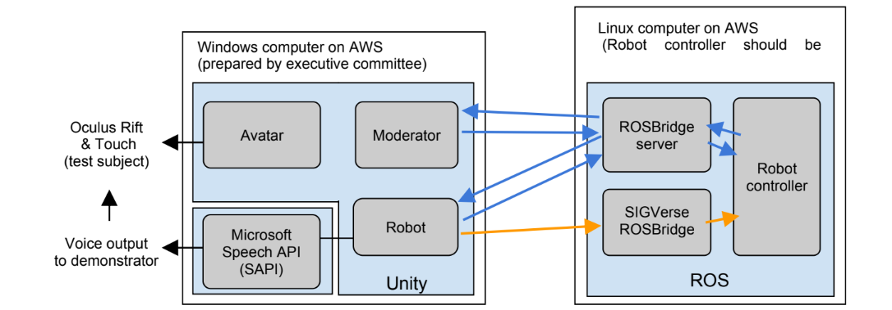

[日本語](./hn_ja.md) | [English](./hn_en.md)

# Human Navigation（HN）

参考動画: [Human Navigation参考動画]()

> [!NOTE]
> 参考動画は完璧ではありません．開催年度のルールによってタスク内容が異なる可能性があるので，あくまで参考程度にしてください．
気になる点や議論したい点などがありましたら，GitHubの[Issues](https://github.com/RoboCupAtHomeJP/AtHome2024/issues)にてご記入ください．

## 概要 - Overview
Human Navigationのタスクの目的は日常生活環境におけるいくつかのタスクを達成するために，
ロボットが人間に対して親しみやすくシンプルな自然言語表現を生成して案内するものです.

例えば，"目の前のテーブルの上にあるコップをキッチンの2段目の引き出しまで持っていってください"というように，
特定の物体をある目的地まで運ぶための自然言語指示をロボットが行うことが求められます．
人(ゲスト)は，仮想現実のアバターにログインして指示に従います．
被験者は，ロボットからの指示に従い，VRセットを使って対象物を手に取り，目的地まで持っていくことを試みます．
対象物の操作を完了するまでの所要時間を計測してポイントを算出します．
人間にとって最も簡単で自然な指示を生成したチームがより高いポイントを得ることができるはずです．

## システム構成 - System Configuration
コンピュータと各プログラムは，図に示すような構成で接続されています．

## セットアップ - Settings
- **システム構成**: 本競技ではシミュレーション環境を実行するWindows PCと，各チームが開発するロボットコントローラを実行するUbuntu PCでrosbridge serverを介した通信を行う．これにより，ロボットのセンサデータの取得や，アバターとロボットのインタラクションを行う．
- **Human navigation-ソフトウェア**: シミュレーション環境を実行するWindows PCでは，UnityとSIGVerseをベースにHuman navigationソフトウェアを実行する．このソフトウェアは，JointState，TF，センサー情報，その他のROSメッセージを一定間隔でロボットコントローラに送信する．セットアップ手順は[こちら](なんかのリンク)．
- **ロボットコントローラ**: 各チームはUbuntu環境において，Human navigationタスクを行うためのロボット制御プログラムの開発を行う．TwistやJointTrajectory，その他のROSメッセージを送信することでロボットを制御する．Ubuntu環境のセットアップ手順は[こちら](なんかのリンク)．
- **ロケーション**: 家庭環境を模したSIGVerse上のシミュレーション環境が用いられる．本競技に用いられる環境は複数あり，競技〇週間前までに本Githubにて公開される．

## 競技の構成 - Competition Structure
競技の流れは以下の通りです．

1.  チームメンバーがROSBridgeサーバ，SIGVerse ROSBridgeサーバ，ロボットコントローラを起動する．

2. 技術委員(TC)がHuman_navi.exeを起動する．

3. 被験者がOculus Rift & Touchを装着．

4. 被験者がセッション開始ボタンを押す．

5. 競技用の環境を読み込み，アバターの位置と向きを初期化する．

6. モデレータがロボットコントローラに"Are_you_ready?"メッセージを送信する．

7. ロボットコントローラーがモデレーターに"I_am_ready"メッセージを送信する．

8. モデレーターがロボットにTaskInfoを送信する．TaskInfoには，目標物と目的地が含まれる．

9. ロボットコントローラは，guidance_message vocal文を生成し，ロボットに送信する．
ロボットコントローラは任意のタイミングでガイダンスメッセージを送信できる．

10. 被検者は，発声に従って，目標物を取り，指定された場所（目的地）に置く．
被検者は誘導メッセージを要求することができる．被験者が新たな誘導メッセージを要求すると，
「Guidance_request」メッセージがロボットコントローラに送信される．

11. 目標物を把持した場合，ポイントが加算される．
> [!WARNING]
> 対象物が把持される前に，誤った対象物が把持された場合，ペナルティが与えられる．

12. 目標物が目的地に入れば，得点が与えられる．
> [!WARNING]
> 指示回数が15回を超えた場合，ペナルティが与えられる．

13. 各セッションは以下のイベントによって終了する．
- **目標物が目的地に設置される場合**:
モデレータからロボットコントローラに"Task_succeeded"が送信される．
- **ロボットコントローラから「Give_up」が送信される場合**:
タスクが達成できない場合，ロボットは"Give_up"メッセージを送ることができる．
その場合，セッションは中断され，モデレーターは"Task_failed"メッセージをロボットコントローラに送信する．
- **時間切れの場合**:
モデレータはロボットコントローラに"Task_failed"メッセージを送信する．
セッション終了．
- **セッションが残っていない場合**:
モデレータはロボットコントローラに「Mission_complete」メッセージを送信する．
- **セッションが残っている場合**:
被験者は次のチームエリアに移動し，Oculus Rift & Touchを装着します．
オペレーターはGo_to_next_sessionボタンを押します．
司会者がロボットコントローラに  「Go_to_next_session」メッセージを送信する．
ステップ5.に戻る．

## セッション数と制限時間 - Number of Sessions and Time Limit
タスクは8セッションで構成され，各セッションの制限時間は3分です．
タイマーは，技術委員会がスタートボタンをクリックした時点で開始されます．

## スコアシート - Score Sheet

<table>
  <tr>
    <th> <b>Action</b> </th>
    <th> <b>Score</b> </th>
  </tr>
  <tr>
    <td colspan="2" align="center"> <b>メインタスク</b> </td>
  </tr>
  <tr>
    <td> アバターが対象物を把持する  
      アバターが対象物を目的地に入れる/載せる   
    </td>
    <td align="center"> 20   20  </td>
  </tr>
  <tr>
    <td colspan="2" align="center"> <b> ボーナスポイント </b> </td>
  </tr>
  <tr>
    <td> 対象物を掴むまでの時間ボーナス  
    対象物を置くまでの時間ボーナス 
    </td>
    <td align="center">remaining time&frasl;time limit*60 remaining time&frasl;time limit*60</td>
    </td>
  </tr>
  <tr>
    <td colspan="2" align="center"> <b> ペナルティ </b> </td>
  </tr>
  <tr>
    <td>間違ったオブジェクトを把持する(各オブジェクトに対して1回) 
    指示文を最大数を超える 
    ロボットが把持対象物体の α [m] 以内に侵入する  
    ロボットが目的地の α [m] 以内に侵入する 
    ロボットがアバター以外と衝突する (各回)
    </td>
    <td align="center"> -5   -3   -40  -40  -10</td>
  </tr>
  <tr>
    <td> <b>総得点 (ペナルティ，ボーナスを除く) （1セッション当たり）</b> </td>
    <td align="center"> <b>40</b> </td>
  </tr>
</table>

実際に使用する課題は平等を期すために各チームで作成したものを用いる．

タイムボーナスは，time_limitとremaining_timeの2つのパラメータで計算されます．
time_limitはNに等しく，remaining_timeはアバターが対象物を掴んだり置いたりした時の残り時間です．

被験者には，得点，ペナルティ，タイムボーナスを事前に説明し，理解しているものとします．

##  仮想環境のレイアウト - Layout of the Virtual Environment
GitHub からいくつかの環境例が公開されています．

- 競技に使用するオブジェクトは，把持対象候補，関連しない物体，家具から構成されます．
これらは，競技会の14日前までにUnityのプロジェクトファイルとして提供されます．
- 部屋のレイアウト情報は，Unityのプロジェクトファイルとして提供されます．
レイアウトの種類は，セッション数（≦M）までとします．
セッション開始時に，システムからルームレイアウトIDが送信されます．
ルームレイアウトとレイアウトIDは，大会の24時間前までに発表される予定です．
- レイアウトの部屋数は常に1つです．
壁やドアで仕切られていない大きな部屋は1つです．
- 複数種類の環境を用意する予定です．
- 本競技の環境には，サンプルで用意されていない家具が含まれ，数量などの変更もあり得ます．

## レフェリー(TC)の動き - Role of the Referee(TC)
- 競技開始30分前に集まり，競技者とともに接続確認を行う．
- スコアシートに基づき，競技を採点する．
- 他のTCと採点内容を確認し合う．
- スコアシートを提出する．

> [!NOTE]
> TCは各チームから数名選出され，他チームの競技において以下を行ってもらう．詳細については，一般規定の[採点方法](./gr_ja.md#採点方法scoring-system)をご確認ください．

## 備考 - Remarks

### 操作する物体 - Objects to Manipulate
- 把持可能なオブジェクトの3Dモデルやプレハブの名称は事前に公開します．
- 物体の位置，量，種類はセッションごとに変化します．
- 同一の物体が環境中に配置されることもあります．
- タスク開始時に各物体の初期位置をソフトウェアAPIでロボットに送信します．
ただし，このメッセージには，オブジェクトが置かれている家具などの情報は含まれていません．
- ソフトウェア通信で使用されるオブジェクト名は，競技前に発表されるオブジェクトリストに示される「プレハブ名」情報に対応しています．

### ロボットの初期位置/方向性 - Initial Position/Orientation of the Robot
全セッションにおいて，ロボットの初期位置・姿勢は（x, y, z, θ）=（0, 0, 0, 0）です．

### タスク情報を参照するためのソフトウェアAPI - Software API for Accessing Task Information
- チームソフトは，ソフトウェアAPIを利用して，以下のタスク情報を参照することができます:
  - ルームレイアウトID
  - 対象オブジェクトのプレハブ名・位置・向き
  - 把持対象物体を置く指定領域の位置，向き，大きさ
  - 把持対象物体と家具以外の把持可能なオブジェクトのプレハブ名，位置，向きのリスト
  - 家具オブジェクトのプレハブ名と位置のリスト
- 通信プロトコルはGitHubで詳細に定義されています．

### ロボットからの指示 - Instructions from the Robot
- ロボットはいつでも自然言語による指示を出すことができます．
- 自然言語による指示は，口頭（SAPI使用）と視覚（Unityのメッセージボード効果使用）で被験者に提供されます．
- メッセージボードは，ロボットの上とアバターの前に表示される2つのボードを使用することができます．
- その仮想メッセージボードに数秒間，指示文が表示されます．それぞれのメッセージボードを使うかどうかは，チームが選択することができます．
- 指示文の文字数は400文字以内とします．
- ロボットからの指示は15回までとします．制限を超えた場合，追加の指示ごとに-3点のペナルティが課されます．
- ロボットはジェスチャーで目的地を指示することができますが，目的地からα[m]（1 ≦ α ≦ 5）以内に近づくと，-40点のペナルティを課します．αは大会の7日前までに発表する．
- アバターや把持可能な物体はロボットと衝突することはありませんので，アバターや把持可能な物体にロボットが衝突してもペナルティはありません．
ロボットが静止物（家具など）に衝突した場合は，-10点のペナルティを与えます．
- 被験者は，Oculus Touchのボタンを使って，いつでも自然言語の指示を要求することができます．
この要求に対してロボットが返信した場合，その返信は指示としてカウントされます．
また，ロボットはこの要求を無視することもできます．
- 練習中，被験者は，タスクを中断してOculus Homeを表示することにつながるオキュラスボタンを押さないことを学びます．
また，誤操作を防ぐために，長押し以外ではオキュラスボタンを作動させないようにオキュラスソフトウェアの設定を行います．
万が一，被験者がOculus Homeのシーンを開いてしまった場合は，できるだけ早くOculusボタンを押すことでセッションに復帰する．
そのために，被験者は練習中にOculus Homeシーンからセッションに戻る方法も学びます．
- Oculus Homeを表示した後，短時間（例えば5秒）で被験者がセッションに戻ることができなかった場合，チームは再試行を要求することができます．
この場合，新しいスコアが最初のスコアより低かったとしても，採用されます．
もちろん，部屋のレイアウトに関する知識がなく，利益相反のない新しい被験者が選ばれます．

### 仮想アバターにログインする被験者 - Virtual Avatar Login for Participants
- 被験者がロボットに質問することはできません．
- 競技との間に利益相反がない被験者を実行委員会が選出します．
- 被験者には，環境について何も知らせません．
- 被験者にはテスト環境において，物体の移動・把持，ドアや引き出しの開閉，ロボットへの指示出しなどの操作手順を事前に説明します．
- 得点，罰則，タイムボーナスを事前に伝えます．
- 名前と外見の対応付けを事前に被験者に示します．
しかし，被験者が常に名前を覚えているとは限りません．
被験者が名前を理解できなくても，主催者の責任ではありません．
チームは，被験者が物や家具を含む文章を理解できるようにする責任があります．

### アバターやオブジェクトの進行状況を参照するためのソフトウェアAPI - Software API for Monitoring the Progress of Avatars and Objects
- ロボットはアバターに関する以下の情報をペナルティなく参照することができます:
  - アバターの頭，胴体，両手の位置と向き
  - 把持した物体の名称と，把持した物体が対象物体であるか否か
- ロボットは把持可能な物体に関する以下の情報をペナルティなしに参照することができます:
  - 引き出しやドアの取っ手を除く，すべての把持可能な物体の位置と方向

### VR関連のデバイス - VR Devices
- アバターの操作には，被験者が以下の機器を使用します:
  - Oculus Rift & Touch
  - 有線イヤホン
  - 防音用イヤーマフ

### 被験者の音声ガイダンス - Voice Guidance for Participants
- SAPIが使用する指示文の音声をWindowsPCが合成します．
被験者は合成音声を聞くために常にイヤホンを装着します．
- イヤーマフを装着しているため，他チームの合成音声は聞こえない状態です．
- SAPIは競技委員会が用意したコンピュータ上で実行されます．
- ロボットから新しい指示メッセージが送られてきたときに，合成音声が話し終わっていない場合は，前の合成音声はキャンセルされ，新しい合成音声が再生されます．