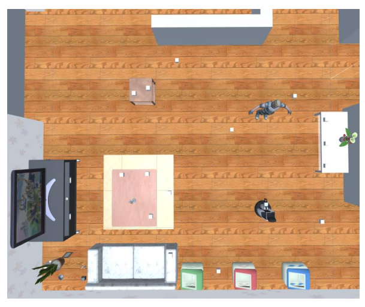
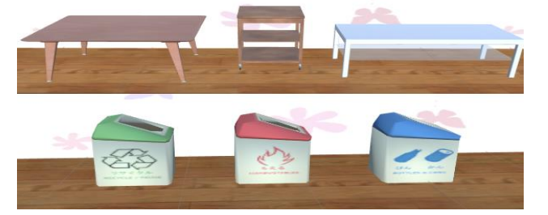

[Japanese](./ic_ja.md) | [English](./ic_en.md)

# Interactive Cleanup (IC)

Reference Video: [Interactive Cleanup Reference Video](https://youtu.be/HHMxg-a5puo)

> **Note**
> The reference video is not perfect. The content of the task may vary depending on the rules of the year it is held, so please take it only as a reference.
> If you have any concerns or points you would like to discuss, please post them in GitHub's [Issues](https://github.com/RoboCupAtHomeJP/Rule2023/issues).

## Overview
This task evaluates the robot's ability to understand pointing gestures. Similar to the Handyman task, it requires basic functionalities such as navigation with obstacle avoidance, object recognition, object manipulation, and human detection. Furthermore, the robot must pay attention not only to the instructions but also to the actions of the human avatar. The pointing gesture performance is fairly distributed among all teams and repeated in several sessions, allowing for a statistical evaluation of the robot's performance.

## System Configuration
Computers and programs are connected as shown in the figure.

On the Windows PC, Handyman software based on Unity and SIGVerse is run. The Ubuntu PC runs a rosbridge server, SIGVerse rosbridge server, and the robot controller implemented by the team.
Communication between the Interactive Cleanup software and the robot controller mainly goes through the rosbridge server, but communication involving large amounts of data such as sensor data goes through SIGVerse's rosbridge server. The Interactive Cleanup software sends ROS messages like JointState, TF, sensor information to the robot controller at regular intervals.
In Interactive Cleanup, when the human avatar issues a cleanup command to the robot, the robot must move according to the instructions from the robot controller. The cleanup instruction is determined based on the actions of the human avatar and the messages sent. The robot controller controls the robot by sending ROS messages such as Twist or JointTrajectory to the Interactive Cleanup software.

## Setup
- **System Configuration**: In this competition, communication is conducted via rosbridge server between a Windows PC running the simulation environment and an Ubuntu PC running the robot controller developed by each team. This facilitates the acquisition of robot sensor data and interaction between the avatar and the robot.
- **Interactive Cleanup Software**: On the Windows PC running the simulation environment, interactive cleanup software based on Unity and SIGVerse is run. This software sends JointState, TF, sensor information, and other ROS messages to the robot controller at regular intervals. Setup instructions are here (some link).
- **Robot Controller**: Each team develops a robot control program in the Ubuntu environment to perform the interactive cleanup task. The robot is controlled by sending Twist, JointTrajectory, and other ROS messages. Setup instructions for the Ubuntu environment are here (some link).
- **Location**: The simulation environment on SIGVerse, simulating a home environment, is used. Multiple environments will be used in this competition, which will be published on this Github several weeks before the competition.

## Task Flow
The flow of the Interactive Cleanup competition is as follows:

1. Launch the robot controller, SIGVerse rosbridge, etc., on the Ubuntu side.
2. Launch the Interactive Cleanup program on the Windows side.
3. Initialize the position and direction of the robot and the object to be grasped.
4. The avatar sends the "Are_you_ready?" message to the robot.
5. The robot sends the "I_am_ready" message to the avatar.
6. The avatar sends the Cleanup command.
7. The avatar moves to point to the object for Cleanup.
8. The "Pick_it_up!" message is sent to the robot.
9. The avatar moves to indicate the location of the object for Cleanup.
10. The "Clean_up!" message is sent to the robot.
11. The avatar moves back to the initial position.
12. Optionally, the robot can request re-pointing.
    - If the robot sends the "Point_it_again" message, this step is repeated. (re-pointing)
13. The robot moves to grasp the object for cleanup.
14. The robot closes its gripper to grasp the object.
15. Optionally, confirmation of whether the object is correct can be performed.
    - After grasping the object, the robot sends the "Is_this_correct?" message, and the avatar responds with "Yes/No". However, points are deducted for each confirmation.
16. The robot sends the "Object_grasped" message to the avatar.
17. The robot moves and releases the object for cleanup.
18. The robot sends the "Task_finished" message to the avatar.
19. The avatar checks the cleanup status and assigns points. The task ends.

### If the Task Ends (Successfully or Unsuccessfully):
- If participants still have attempts left, the avatar sends the "Task_succeeded" (successful task) or "Task_failed" (unsuccessful task) message to the robot to start the next task.
- When participants have no attempts left, the avatar sends the "Mission_complete" message to the robot to end the competitive challenge.

### If the Time Limit Has Passed:
- The avatar sends the "Task_failed" message to the robot to indicate the task was unsuccessful.

### If Users Want to Withdraw from the Task:
- Users press the Give Up button on the screen to have the avatar send the "Task_failed" message to the robot and indicate the task was unsuccessful.

### Results of Cleanup:
- Cleanup is considered successful if the object for cleanup is placed on the table or disposed of in the garbage box indicated by the avatar.
- If it is impossible to complete the task, the robot can send the "Give_up" message. In that case, the task is aborted, and the "Task_failed" message is sent, then proceed to the next session.

## Number of Sessions and Time Limit
The Interactive Cleanup task consists of 10 sessions, with a time limit of 6 minutes per session. The timer for the time limit starts when sensor information is delivered to the robot.

## Score Sheet

<table>
  <tr>
    <th> <b>Action</b> </th>
    <th> <b>Score</b> </th>
  </tr>
  <tr>
    <td colspan="2" align="center"> <b>Main Task</b> </td>
  </tr>
  <tr>
    <td> Robot correctly grasps the target object   
      Robot incorrectly grasps the target object   
      Robot successfully disposes of or relocates the target object  
      Robot incorrectly disposes of or relocates the target object 
      Robot confirms the correctness of the object (each time) 
      Robot requests a repetition of the pointing gesture (each time) 
      Robot collides with an object (each time)  
      Grasped/released object collides with another object (each time)
    </td>
    <td align="center"> 50   -10 50  -10  -10  -10  -0  -0 </td>
  </tr>

  <tr>
   
  <tr>
    <td> <b>Total Points (excluding penalties and bonuses) (per session)</b> </td>
    <td align="center"> <b>100</b> </td>
  </tr>
</table>

The score for a session is calculated as the total of the above scores during the session. If a session's score falls below zero due to many deductions, that session is treated as having zero points. The total score for Interactive Cleanup is calculated as the sum of all session scores.

## Competition Screen
An example of the screen during the Unity competition is shown below.

The meaning of each component is explained in GitHub's wiki as follows.
URL: https://github.com/RoboCupatHomeSim/interactive-cleanup-unity/wiki/Screen

## Room Layout
An example of the room used in the competition is shown below.

## Target Objects for Grasping
Examples of objects that the robot will grasp are shown below. The final list of candidate objects will be announced 14 days before the competition.

## Destination (Carrying Destination for Objects)
The avatar indicates the destination of the target object to the robot with the second pointing gesture. The destination is either on top of furniture or inside a trash can. Examples of destinations used in the task are shown below. The list of destination objects will be announced 14 days before the competition.

## Notes

### Pointing Gesture
The avatar performs two pointing gestures. The first and second pointing gestures specify the object to be grasped and its destination, respectively. The avatar maintains each posture/gesture for n seconds. In pointing gestures, the avatar always uses the index finger. The direction of the pointing gestures is determined randomly for each session. The range of the duration of pause time is 2 ≤ n ≤ 10.

### Robot and Avatar
The initial positions of the robot and the human avatar are always the same for all sessions. The initial posture of the robot is set so that the robot can capture the image of the human avatar with the HeadCenterCamera.

### System Setup and Competition Rules

#### Preparation Schedule
- The detailed schedule and time limits for the competition day will be updated 7 days before the competition.
- The list of objects in the Unity project file will be published 14 days before the competition.
- The layout in the Unity project file will be published 24 hours before the competition.
- The robot controller PC setup and cessation of software modifications will be done N hours before the competition start. The value of N will be announced 7 days before the competition, with n ranging from 0 ≤ n ≤ 3.

#### Software Execution (in virtual style)
Teams run the robot controller. When the technical committee announces the start of the competition, the technical committee runs the Interactive Cleanup software on the Windows side. If software trouble occurs, the technical committee will perform trouble resolution as described in section 1.4. In this case, the software's internal time counter is paused, but teams must complete all sessions within the real-world time limit. If a team's software cannot complete all sessions within the real-world time limit, the cumulative score up to the session where the time limit ended will be considered as the total score. The real-world time limit will be announced at least 7 days before the competition. The real-world time limit is set to [time limit per session × number of sessions] minutes.

### Regarding Questions
The RoboCup@Home Simulation community needs to keep a stock of all questions used in past competitions. Some questions for this competition may be reused from questions of past @Home Simulation competitions. Past questions can be checked on Github. Each team is requested to submit new questions to be used in the competition. New questions contribute to the improvement of the question database and should be kept confidential among teams to maintain their competitive advantage. There are disadvantages to the team that created the question, as they can score points through specific algorithms or codes to solve the question. However, we also want to provide incentives for creating questions. As known, in robot research using machine learning, the importance of datasets is increasingly recognized. Interactive robots in RoboCup@Home are no exception. Creating such new questions within the RoboCup community and increasing the dataset of questions will contribute to the development of RoboCup and the improvement of robot research as a whole.
