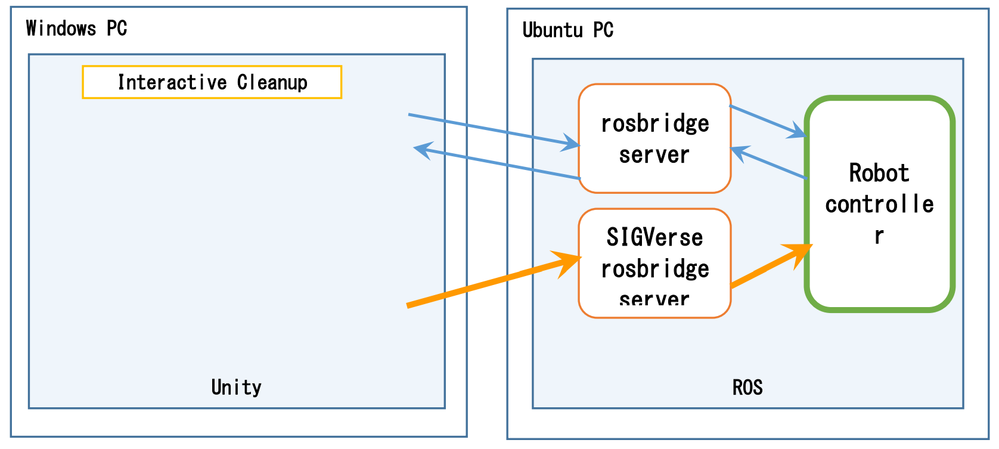
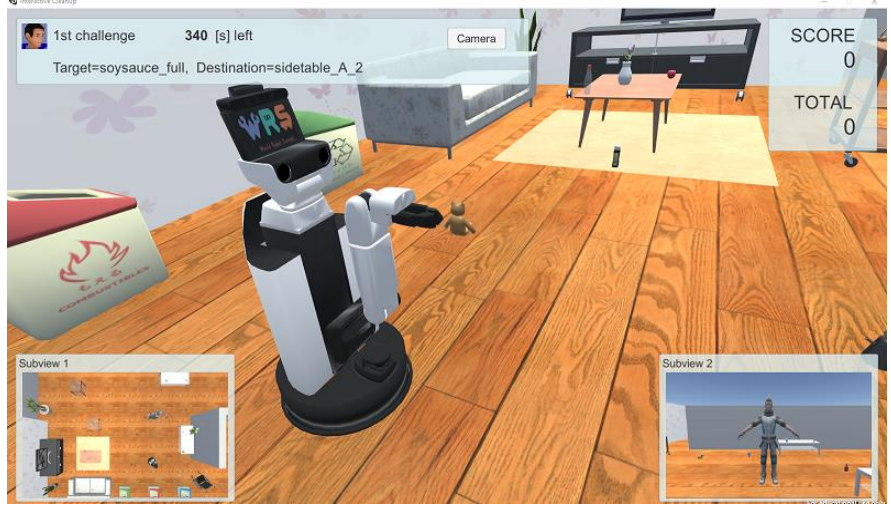
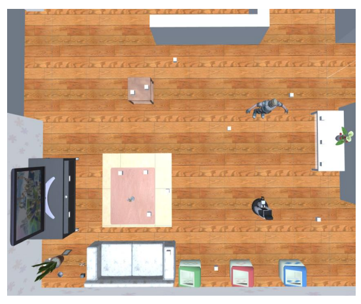
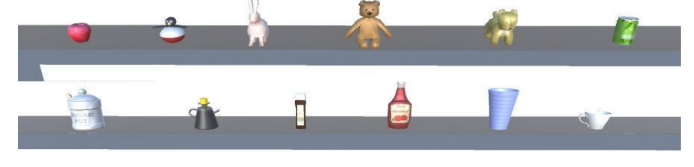
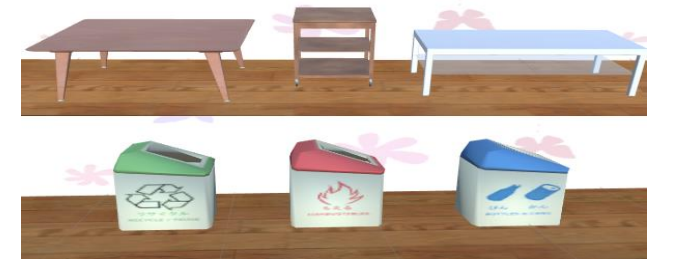

[日本語](./ic_ja.md) | [English](./ic_en.md)

# Interactive Cleanup（IC）

参考動画：[Interactive Cleanup参考動画](https://youtu.be/HHMxg-a5puo)

> **Note**
> 参考動画は完璧ではありません．開催年度のルールによってタスク内容が異なる可能性があるので，あくまで参考程度にしてください．
> 気になる点や議論したい点などがありましたら，GitHubの[Issues](https://github.com/RoboCupAtHomeJP/Rule2023/issues)にてご記入ください．

## 概要
このタスクは，ロボットが指差しジェスチャを理解する能力を評価するものです．Handyman タスクと同様に，障害物回避を伴うナビゲーション，物体認識，物体操作，人間検出などの基本機能が要求されます．さらに，ロボットは指示内容だけでなく，人間のアバターの行動にも注意を払う必要があります．指差しジェスチャの動作は全チームに公平に配分され，数回のセッションが繰り返されるため，ロボットの性能を統計的に評価することができます．

## システム構成
コンピュータと各プログラムは，図に示すような構成で接続されています．

Windows PC では Unity と SIGVerse をベースにした Handyman ソフトウェアを実行します．UbuntuPC は rosbridge server，SIGVerse rosbridge server，チームが実装したロボットコントローラを実行します．
Interactive Cleanup ソフトウェアとロボットコントローラの通信は基本的に rosbridge server を経由しますが，センサーデータなどの大量のデータを含む通信は SIGVerse の rosbridge server を経由して送られます．Interactive Cleanup ソフトウェアは，JointState，TF，センサー情報などの ROS メッセージを一定時間ごとにロボットコントローラに送信します．
Interactive Cleanup では，人間のアバターがロボットに対して片付け命令を出すと，ロボットはロボットコントローラの指示に従って移動する必要があります．片付けの指示は，人間のアバターの動作や送られてくるメッセージに基づいて決定されます．ロボットコントローラは，Twist や JointTrajectory などのROS メッセージを Interactive Cleanup ソフトウェアに送信することでロボットを制御します．

## セットアップ
- **システム構成**：本競技ではシミュレーション環境を実行するWindows PCと，各チームが開発するロボットコントローラを実行するUbuntu PCでrosbridge serverを介した通信を行う．これにより，ロボットのセンサデータの取得や，アバターとロボットのインタラクションを行う．
- **interactive cleaup-ソフトウェア**：シミュレーション環境を実行するWindows PCでは，UnityとSIGVerseをベースにinteractive cleaupソフトウェアを実行する．このソフトウェアは，JointState，TF，センサー情報，その他のROSメッセージを一定間隔でロボットコントローラに送信する．セットアップ手順はこちら（なんかのリンク）
- **ロボットコントローラ**：各チームはUbuntu環境において，interactive cleaupタスクを行うためのロボット制御プログラムの開発を行う．TwistやJointTrajectory，その他のROSメッセージを送信することでロボットを制御する．Ubuntu環境のセットアップ手順はこちら（なんかのリンク）
- **ロケーション**：家庭環境を模したSIGVerse上のシミュレーション環境が用いられる．本競技に用いられる環境は複数あり，競技〇週間前までに本Githubにて公開される．

## タスクの流れ
Interactive Cleanupの競技の流れをいかに示します．

1． Ubuntu側でロボットコントローラー，SIGVerse rosbridgeなどを起動します．
2． Windows側でInteractive Cleanupプログラムを起動します．
3． ロボットと把持するオブジェクトの位置と方向を初期化します．
4． アバターがロボットに対して「Are_you_ready?」(準備はいいですか？)メッセージを送信します．
5． ロボットがアバターに「I_am_ready」(準備ができました)メッセージを送信します．
6． アバターがCleanupコマンドを送信します．
7． アバターはCleanupのためのオブジェクトを指し示すために移動します．
8． 「Pick_it_up!」(拾って！)メッセージがロボットに送信されます．
9． アバターはCleanupのためのオブジェクトの位置を示すために移動します．
10． 「Clean_up!」(片づけて！)メッセージがロボットに送信されます．
11． アバターは初期位置に戻ります．
12． ロボットはオプションで再指示を要求することができます．
    - ロボットが「Point_it_again」(もう一度指示して)メッセージを送信した場合，このステップが繰り返されます．（再指示）
13． ロボットは把持するオブジェクトに移動します．
14． ロボットはグリッパーを閉じてオブジェクトを掴みます．
15． オブジェクトが正しいかどうかの確認をオプションで行うことができます．
    - ロボットがオブジェクトを掴んだ後，「Is_this_correct?」(これで正しいですか？)メッセージを送信し，アバターが「Yes/No」(はい/いいえ)で応答します．ただし，確認ごとに減点されます．
16． ロボットは「Object_grasped」(オブジェクトを掴みました)メッセージをアバターに送信します．
17． ロボットは移動してCleanupのためのオブジェクトを解放します．
18． ロボットは「Task_finished」(タスク終了)メッセージをアバターに送信します．
19． アバターはCleanupの状態を確認し，ポイントを割り当てます．タスクが終了します．

### タスクが終了した場合（成功または失敗）:
- アバターは参加者にまだ試行が残っている場合，ロボットに「Task_succeeded」(タスク成功)または「Task_failed」(タスク失敗)メッセージを送信して次のタスクを開始します．
- 参加者に試行が残っていない場合，アバターはロボットに「Mission_complete」(ミッション完了)メッセージを送信して競技チャレンジを終了します．

### 時間制限が過ぎた場合:
- アバターは「Task_failed」(タスク失敗)メッセージをロボットに送信してタスクが失敗したことを示します．

### タスクから撤退したい場合:
- ユーザーは画面上のGive Upボタンを押して，アバターに「Task_failed」(タスク失敗)メッセージをロボットに送信させ，タスクが失敗したことを示します．

### Cleanupの結果:
- Cleanupは，アバターが指し示したテーブル上またはゴミ箱にクリーンアップのためのオブジェクトが置かれた場合に成功とみなされます．
- タスクを達成することが不可能である場合，ロボットは「Give_up」(諦める)メッセージを送信することができます．その場合，タスクは中断され，「Task_failed」(タスク失敗)メッセージが送信され，次のセッションに進みます．

## セッション数と制限時間
Interactive Cleanup タスクは 10 セッションで構成され，各セッションの制限時間は 6 分です．またセンサー情報がロボットに配信された時点で制限時間のタイマーが開始されます．

## スコアシート（Score Sheet）

<table>
  <tr>
    <th> <b>Action</b> </th>
    <th> <b>Score</b> </th>
  </tr>
  <tr>
    <td colspan="2" align="center"> <b>メインタスク</b> </td>
  </tr>
  <tr>
    <td> ロボットが正しく把持対象物体を把持する   
      ロボットが把持対象物体を誤って把持する    
      ロボットが対象物の廃棄や再配置に成功した場合  
      ロボットが対象物の廃棄や再配置を誤る 
      ロボットがオブジェクトの正否を確認する（各回） 
      ロボットが指差しジェスチャの繰り返しを要求する（各回） 
      ロボットが物体に衝突する（各回）  
      ロボットが把持・解放した物体が他の物体と衝突する（各回）
    </td>
    <td align="center"> 50   -10 50  -10  -10  -10  -0  -0 </td>
  </tr>

  <tr>
   
  <tr>
    <td> <b>総得点 (ペナルティ，ボーナスを除く) （1セッション当たり）</b> </td>
    <td align="center"> <b>100</b> </td>
  </tr>
</table>

セッションのスコアは，セッション中の上記スコアの合計として算出されます．多くの減点を重ねて，セッションの点数が0点を下回った場合，そのセッションは0点として扱います．Interactive Cleanup の総スコアは，すべてのセッションスコアの合計として計算されます．

## 競技画面
Unity の競技中の画面の例を下図に示します．

各コンポーネントの意味は，GitHub の wiki で以下のように説明されています．
URL:https://github．com/RoboCupatHomeSim/interactive-cleanup-unity/wiki/Screen

## Room Layout
本競技で使用する部屋の一例を下図に示します．

## 把持対象物体
ロボットが把持する対象物の例を下図に示します．最終的な候補物は，大会の14日前までに発表さ
れる予定です．

## 目的地（物体の持ち運び先）
アバターは2回目の指差しジェスチャによって，ターゲットオブジェクトの行き先をロボットに指示します．目的地は家具の上かゴミ箱の中です．タスクで使用した目的地の例を下図に示します．目的地のオブジェクトリストは，大会の14日前までに発表される予定です．

## 備考

### 指差しジェスチャ
アバターは2つの指差しジェスチャを行います．1つ目の指差しジェスチャと2つ目の指差しジェスチャは，それぞれ把持対象物体とその目的地を特定します．アバターは各姿勢／ジェスチャをn秒間維持します．指差しジェスチャにおいてアバターは常に人差し指を使用します．指差しジェスチャの方向は，セッションごとにランダムに決定されます．一時停止時間の持続時間の範囲は，2 ≦ n ≦ 10です．

### ロボットとアバター
ロボットと人間のアバターの初期位置は，すべてのセッションで常に同じです．ロボットの初期姿勢は，ロボットがHeadCenterCameraによって人間のアバター画像を写すことができるように設定されます．

### システムセットアップと競技規約

#### 準備段階のスケジュール
- 大会の7日前までに競技日の詳細なタイムスケジュールと制限時間を更新します．
- 大会14日前までUnityプロジェクトファイルのオブジェクトリストが公開されます．
- 開催24時間前までUnityのプロジェクトファイルにてレイアウトを公開します．
- 競技開始のN時間前にロボットのコントローラーPCをセットアップし，ソフトウェアの改変を停止する．Nの値は大会7日前までに発表され，nの範囲は0 ≦ n ≦ 3とします．

#### ソフトウェアの実行(in virtual style)
チームはロボットコントローラを実行します．技術委員会から競技開始の通知があると，技術委員会はWindows側でInteractive Cleanupソフトウェアを実行します．ソフトウェアトラブルが発生した場合，技術委員会は1．4節に記載されているトラブル対応を行います．この場合，ソフトウェア内のタイムカウンターは一時停止されますが，チームは現実世界の制限時間内にすべてのセッションを終了する必要があります．チームのソフトウェアが現実世界の制限時間内にすべてのセッションを終了できない場合，制限時間が終了したセッションまでの累積スコアを合計スコアとします．現実世界の制限時間は，少なくとも大会の7日前に発表される．現実世界の制限時間は，[セッションあたりの制限時間×セッション数]分とします．

### 質問事項に関して
ロボカップ@ホームシミュレーションコミュニティは，過去の大会で使用された問題をすべてストックしておく必要があります．本大会の問題の一部は過去の@Home Simulation大会の問題から再利用される予定です．過去の問題はGithubで確認することができます．各チームは，コンペティションで使用する新しい質問を提出してください．新しい質問は，質問データベースの改善に貢献するためであり，チームの優位性を保つために他のチームには非公開にする必要があります．問題を作成したチームは，その問題を解くための特定のアルゴリズムやコードによって得点を得ることができるというデメリットはありますが，問題を作成するためのインセンティブを提供したいとも考えています．ご存知のように，機械学習を用いたロボット研究において，データセットの重要性はますます高まっています．ロボカップ@ホームの対話型ロボットも例外ではありません．ロボカップコミュニティでこのような新しい質問を作り，質問のデータセットを増やしていくことが，ロボカップの発展やロボット研究全体の向上につながると考えています．
