[日本語](./make_task_ja.md) | [English](./make_task_en.md)

# Competition Task Creation Procedure

From the perspective of fairness, each team is asked to create some of the problems used in the competition. Please check the problem creation procedures for each competition as follows.

For Handyman and Interactive Cleanup task creation methods, please also refer to our video explanation available here.

[Task Creation Instruction Video](https://youtu.be/JrrpMxX3Vh8)

## Spreadsheets for Task Description
Duplicate the following Google Spreadsheet templates and describe the task you created. This description will be used for commentary in the competition and checking by admin members.
- [Handyman Task Description Template](https://docs.google.com/spreadsheets/d/1mMqzx-0CZG0YOU-FLNQnZLh0BB7g3noFKtWkBDInizA/edit?usp=sharing)
- [InteractiveCleanup Task Description Template](https://docs.google.com/spreadsheets/d/1-ZKrXuRVkZL1UqjX_ld2nFJ09bWUW1WfOwaq7lt5qFg/edit?usp=sharing)
- [Human_Navigation Task Description Template](https://docs.google.com/spreadsheets/d/1SK99wUuujxUdwD_PsWOkBpM4jD_pY_QRzsUibcTXRNU/edit?usp=sharing)

# Handyman Competition Task Creation

For the basic flow of task creation, please refer to GitHub's [Readme](https://github.com/RoboCupatHomeSim/handyman-unity) and [Wiki](https://github.com/RoboCupatHomeSim/handyman-unity/wiki/AdvancedExecutionProcedures#how-to-create-the-environmentinfoxxjson). Follow the steps below to ensure the created layout is appropriate.

## About Difficulty Adjustment
- Tasks should primarily be of easy difficulty.
- Ensure there is a sufficient difference in difficulty between trials. Currently, there are mostly easy tasks, so this is not an issue.
- Factors influencing difficulty:
  - Size of the room
  - Narrowness of passages
  - Presence of dynamic obstacle avatars (EthanWoman)
  - Length of travel distance
  - Layouts with many objects
  - If the grasp target is an a-like object
  - Movement of the instructor (Ethan)
  - If the grasp target's destination is movable furniture (such as a trash can)
  - If the task message includes words expressing spatial relations
  - If the task message contains contradictions
  - If the grasp target is lying down
- Currently, unknown environments will not be set up; everything will be published in advance.

## Task Creation Steps

Proceed by adding task content sheets to a Google Spreadsheet named "HandymanTask Template."

[Template here](#spreadsheets-for-task-description)

### Preparing the Template Sheet
- Copy the following template sheets listed in the Handyman task memo to create your task sheet.
  - **Template Sheet Summary (as of 2023/05/15):**
    - Template2019HM01
    - Template2019HM02
    - Template2020HM01
    - Template2021HM01
  - Each template sheet has a different layout.
  - Rename the template sheet to something easy to understand, such as "TeamName_TaskNumber_CompetitionName". Example: InamuraLab_01_JapanOpen2023

### Editing the Task Sheet
- Develop your task and adjust the diagram or task statement on the sheet.
  - Be mindful that the task statement clearly identifies the grasp target and delivery destination.
  - Keep the task statement to about 150 characters.
  - The room name in the task statement should be the name of the room where the grasp target is placed.
  - For the latest information on room names and usable prepositions, refer to the "Object Label List" spreadsheet.

### Working in Unity
- Copy the competition scene (Handyman.unity) in Unity and create a scene for task creation.
  - Save the task creation scene in the `Assets/AssetStoreTools` folder. This folder is configured in gitignore to prevent accidental pushes to GitHub.
- Open the task creation scene in Unity and follow the Wiki instructions to create your task.
  - If necessary, adjust the trash cans or GraspingCandidatesPositionXX.

### Task Verification
- Copy Handyman.unity to create a production Unity scene under the `Hidden` folder and verify the operation of all tasks.

### Submitting the Task
- If it's necessary to submit the task to a manager (e.g., admin), prepare the created task's template sheet along with `AvatarMotionsXX.dat`, `EnvironmentInfoXX.json`, and submit them after verification by the specified method.

### Updating the 3D Model List (Object Label List)
- The list of 3D models used in each competition is managed with the "Object Label" spreadsheet shared in advance.
  - Update this list if new a-like objects are added or the handling of 3D models changes.

 
 

# Interactive Cleanup Task Creation Procedure

For the basic flow of task creation, please refer to GitHub's [Readme](https://github.com/RoboCupatHomeSim/interactive-cleanup-unity) and [Wiki](https://github.com/RoboCupatHomeSim/interactive-cleanup-unity/wiki/AdvancedExecutionProcedures#generate-the-competition-data-using-oculus-quest-2). Follow the steps below to ensure the created layout is appropriate.

## About Difficulty Adjustment

Before creating tasks, please review the items related to task difficulty adjustment.

- The difficulty level should generally be set to easy.
- Difficulty is primarily controlled through pointing actions.
- Ensure there is a sufficient difference in difficulty between trials.
- The more the avatar moves, the higher the difficulty.
- The faster the avatar moves, the higher the difficulty.
- Only one graspable object is allowed per table or shelf. Do not place two objects on one table.
- While many objects are by default placed on the floor, obstacles should be moved to non-obstructive positions as high obstacle density increases difficulty.
- Shorter pointing times increase difficulty.
- Pointing at distant objects increases difficulty.
- Back-facing pointing towards the robot increases difficulty.
- Bending the elbow during pointing increases difficulty.

### Additional Notes

- Grasp targets placed on the floor are mostly undetectable by laser range finders due to their height.

## Task Creation Steps

Proceed with creating task files by adding task content sheets to a Google Spreadsheet named "InteractiveCleanupTask Template". Please also have the InteractiveCleanupTask Template open while working.

[Template here](#spreadsheets-for-task-description)

### Preparing the Task Sheet
- Copy the "Template" sheet to create your task sheet.
- Rename the copied task sheet to something easily understandable, e.g., "TeamName_TaskNumber_CompetitionName" (Example: InamuraLab_01_JapanOpen2023)

### Editing Task Content
- Develop your task idea and adjust the diagram on the task sheet.
  - Grasp targets (blue circle) and destinations (red circle) are mandatory.
  - Arrows are not needed if there is no movement.
  - Obstacle objects (pink circle) are generally unnecessary. If you want to increase difficulty, place graspable objects as obstacles on the floor.

### Working in Unity
- Copy the competition scene in Unity and create a scene for task creation.
  - Place the task creation scene in the `Assets/AssetStoreTools` folder, which is set to gitignore.
- Open the task creation scene in Unity, move the grasp candidate position objects (white cubes), and develop your task.
  - Grasp candidate position objects are, for example, objects like `Layout2019IC01/GraspingCandidatesPositions/GraspingCandidatesPositionXX`.
  - Move one of the grasp candidate position objects to the grasp target's location (blue circle), and slightly move the remaining 13.

### VR Device Setup and Data Generation
- Connect the VR device to the PC, start SteamVR or Oculus software, and ensure it's ready to use.
- Set up "XR Plug-in Management" in the Unity Editor, launch Interactive Cleanup in data generation mode (executionMode = 1), and generate pointing actions.

### Task Verification and Submission
- Launch Interactive Cleanup in normal mode (executionMode = 0), verify the appropriateness of the task content, and note the name of the grasp target.
- If submission to a task manager is required, prepare the task's template sheet along with `AvatarMotionsXX.dat`, `EnvironmentInfoXX.json`, and submit them.

### Updating the 3D Model List (Object Label List)
- The list of 3D models used in each competition is managed in advance with the "Object Label" spreadsheet.
  - Update this list if new a-like objects are added or if there are changes in handling 3D models.

# Human Navigation Task Creation Procedure

## Basic Flow of Task Creation

For the basic flow of task creation, please refer to GitHub's [Readme](https://github.com/RoboCupatHomeSim/human-navigation-unity) and [Wiki](https://github.com/RoboCupatHomeSim/human-navigation-unity/wiki/AdvancedExecutionProcedures#how-to-create-new-environments). Follow the steps below to ensure the created layout is appropriate.

## About Difficulty Adjustment

Before creating tasks, please review the items related to task difficulty adjustment.

- The current focus is on making the difficulty easy.
- Ensure a sufficient difference in difficulty between trials.
- Larger rooms increase difficulty.
- A higher number of graspable objects increases difficulty.
- Fewer landmark objects for explaining the location of the grasp target or destination increase difficulty.
- Tasks that are difficult for humans to explain are considered high difficulty.

Task difficulty is primarily adjusted by the following factors:

1. **Size of the Room:** Larger rooms make navigation more challenging.
2. **Number of Graspable Objects:** More objects make it difficult to find the specific target object.
3. **Number of Landmark Objects:** Fewer landmark objects make navigation to the target or destination more challenging.
4. **Difficulty of Task Description:** Descriptions that are difficult for humans to understand are considered high difficulty.

When creating tasks, it's important to consider these factors and adjust the level so that participants can feasibly solve them.

## Task Creation Steps

Proceed with creating task files by adding task content sheets to a Google Spreadsheet named "HumanNavigationTask Template". Work with the HumanNavigationTask Template open.

[Template here](#spreadsheets-for-task-description)

1. Develop your task idea. Decide on the ratio of new problems to past problems, and for new problems, create new layouts. Two questions will be asked from each new layout. For example, if you are creating four new problems, you need to create two new layouts. (As of 2022) At this stage, you only need to think about what kind of layout to create.
2. Open the standard [HumanNavi](https://github.com/RoboCupatHomeSim/human-navigation-unity) (not the Cloud version) in Unity Editor.
3. Copy the HumanNavi.unity competition scene in Unity and create a scene for task creation. Name it something like HumanNavi2022.unity. Place the task creation scene in the Assets/Competition/HumanNavi/HiddenFiles folder. The HiddenFiles folder is set to gitignore to prevent accidental pushes to GitHub. Create the HiddenFiles folder if it does not exist.

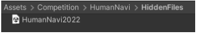

4. Open the task creation scene in Unity and follow the Wiki instructions to create your task. Refer to the "Task Creation" sheet in the HumanNavigationTask Template for precautions and other details. Create the layout (furniture, graspable object placement) and destinations.
5. Create a dummy destination for layout verification. While the layout will be notified to participants in advance, create a dummy destination for layout verification purposes. Place the dummy destination named destination#00 at the feet of the human avatar. Use existing layout items to create this.
6. Copy the template sheet to create your task sheet. There are also past question sheets available. Take a screenshot of the new layout from the Unity screen for the new layout image.
7. Create a configuration file for operation verification (HumanNaviConfig.json). It's easier to modify the previous configuration file as a reference. Refer to the Wiki for the configuration file specifications.
8. Execute the task creation scene to verify the operation of planned new and past questions. Run the [sample ROS node](https://github.com/RoboCupatHomeSim/human-navigation-ros#how-to-execute-sample-ros-node) on the ROS side. Check if the task can be cleared normally, and also verify if the layout itself is normal, including unrelated object grasping and cabinet opening and closing.
9. Create Prefabs for the new layout. This process is a bit complex. Create the following two types of Prefabs:
   - Prefab without the correct destination#XX
     - Name it something like Layout2022HN01#01Layout
     - To be published before the competition
   - Prefab with the correct destination#XX included
     - Name it something like Layout2022HN01#01
     - To be published after the competition

   Essentially, you're creating nested Prefabs. Since the correct destination#XX cannot be published, only the first type of Prefab will be published on GitHub or elsewhere before the competition. The second type of Prefab is used for the competition and will be published afterward. The creation method for these two types of Prefabs is as follows:

   - Create a folder for this occasion under Assets/Competition/HumanNavi, such as Assets/Competition/HumanNavi/IROS2022.

   - Temporarily remove all destination#XX (except for destination#00) from the layout (Layout2022HN01#01, etc.) by moving them to the scene root.
   
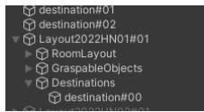

   - Drag and drop the layout (Layout2022HN01#01, etc.) under the folder for this occasion to create a layout Prefab.
   
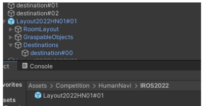

   - Add "Layout" to the name of the created Prefab.
   
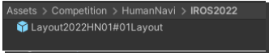

   - Return the destination#XX to their original positions.
   
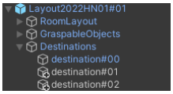

   - Drag and drop the layout (Layout2022HN01#01, etc.) under the HiddenFiles folder to create a layout Prefab. ※In the [Create Prefab or Variant?] window, select [Prefab Variant].
   
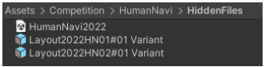

   - Remove "Variant" from the name of the created Prefab Variant.
   
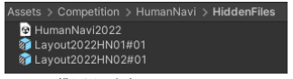

   - Repeat for all layouts.

        
10. Export the unitypackage. Click [Assets]-[Export Package...] and select the created Prefabs to export.

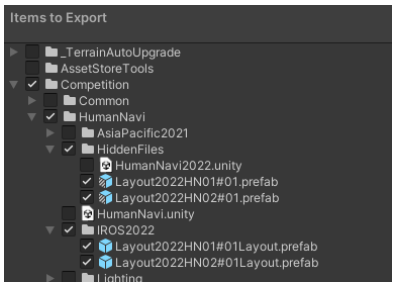

11. Compile the deliverables. The deliverables include the HumanNavigationTask Template task sheet, the unitypackage file containing the new layout, and the configuration file.

## Compiling All Tasks

- Compile the individually created task sheets, unitypackage files containing the new layout, and configuration files.
  1. Collect tasks. Collect all tasks created by participating teams, including task sheets, unitypackage files containing the new layout, and configuration files.
  2. Compile the task sheets into one Google Spreadsheet.
  3. Compile all tasks into one configuration file.
  4. Open the standard HumanNavi (not the Cloud version) in Unity Editor.
  5. Copy the HumanNavi.unity competition scene in Unity and create a scene for task creation. Name it something like HumanNavi2022.unity. Place the task creation scene in the Assets/Competition/HumanNavi/HiddenFiles folder. The HiddenFiles folder is set to gitignore to prevent accidental pushes to GitHub. Create the HiddenFiles folder if it does not exist.
  6. Open the task creation scene.
  7. Import the unitypackage file containing all new layouts. Import is possible via [Assets]-[Import Package]-[Custom Package...]. Repeat for all new layouts.
  8. Add new layouts to the task creation scene. Add new layout Prefabs to the scene by dragging and dropping them. Use Prefabs under the HiddenFiles (including destination#XX).
  9. Add new layouts to the HumanNaviSessionManager attached to the Moderator in the Environments section. Increase the size of Environments by the number of new layouts and add all new layouts to the Elements.

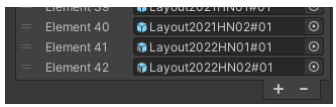

  10. Execute the task creation scene to verify the operation of planned new and past questions. Run the [sample ROS node](https://github.com/RoboCupatHomeSim/human-navigation-ros#how-to-execute-sample-ros-node) on the ROS side. Check if the task can be cleared normally and also verify if the layout itself is normal, including unrelated object grasping and cabinet opening and closing.

## Creating a Layout Verification Unity Scene

Create a layout verification Unity scene for participants to verify new layouts. Do not include the correct destination#XX.

1. Open the standard HumanNavi (not the Cloud version) in Unity Editor.
2. Copy the HumanNavi.unity competition scene in Unity and create a scene for layout verification. Name it something like `HumanNavi2022Layout.unity`. Place the layout verification scene in the folder for this occasion (`Assets/Competition/HumanNavi/IROS2022`, etc.).

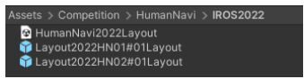

3. Open the layout verification scene.
4. Place the Prefab without the correct destination#XX (`Layout2022HN01#01Layout`, etc.) in the scene.

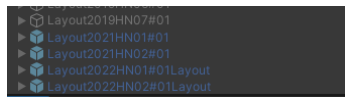

5. If the root GameObject of the added layout is active, uncheck it in the Inspector.

6. Remove "Layout" from the end of the added layout's name.

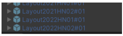

7. Ensure the destination is only `destination#00` for all added layouts.

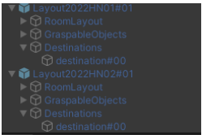

8. Add new layouts to the HumanNaviSessionManager attached to the Moderator in the Environments section. Increase the size of Environments by the number of new layouts and add all new layouts to the Elements.

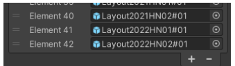

9. Create a layout verification configuration file (`HumanNaviConfig.json`).
   - `sessionTimeLimit`: 999
   - `recoverUsingScoreFile`: false
   - `maxNumberOfTrials`: The number of new layouts (not the number of tasks)
   - `taskInfoList`: Include new layout information. The target is a dummy, so list any object from GraspableObjects in the layout as the target, and set the destination to `destination#01` fixed. At this point, it's `destination#01`, not `#00`.

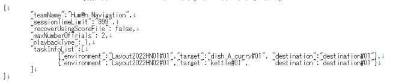

10. Execute the layout verification scene to ensure an error occurs. Run the [sample ROS node](https://github.com/RoboCupatHomeSim/human-navigation-ros#how-to-execute-sample-ros-node) on the ROS side. Since `destination#01` should not exist, an error is expected.
11. Correct the layout verification configuration file. Set the destination to `destination#00`.

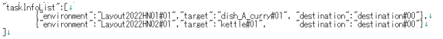

12. Execute the layout verification scene for operation verification. Run the sample ROS node. Check if the layout itself is as expected, including object grasping and cabinet opening and closing.
13. When the time comes, publish the layout verification Unity files on GitHub or elsewhere. New layouts will be published when the time is right. Publish the following files:
    - The folder for this occasion (`Assets/Competition/HumanNavi/IROS2022`, etc.)
    - The layout verification configuration file. Rename the configuration file to `HumanNaviConfig_NewLayouts.json` and place it in the configuration file's folder for this occasion (`SIGVerseConfig/HumanNavi/sample/IROS2022`, etc.).

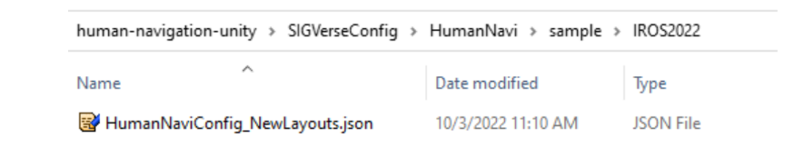

## Task Verification

1. Open the production version of [HumanNavi](https://github.com/RoboCupatHomeSim/human-navigation-cloud-unity) for use in the competition in Unity Editor.
2. Import the previously mentioned unitypackage file (containing all new layouts). It includes both the production Prefabs and the layout verification Prefabs. Import is possible via `[Assets]-[Import Package]-[Custom Package...]`.
3. Copy `HumanNavi.unity` to create a production Unity scene. Name it something like `HumanNavi2022.unity`. Place the production scene in the `Assets/Competition/HumanNavi/HiddenFiles` folder. The `HiddenFiles` folder is set to gitignore to prevent accidental pushes to GitHub.
4. Open the production scene.
5. Add new layouts to the production scene. Add new layout Prefabs to the scene by dragging and dropping them. Use Prefabs under `HiddenFiles` (including destination#XX).

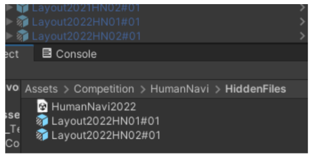

6. Add new layouts to the HumanNaviSessionManager attached to the Moderator in the Environments section. Increase the size of Environments by the number of new layouts and add all new layouts to the Elements.
7. Add the new layout's Graspables to the `RootsOfSyncTarget` attached to the PunLauncher. Cloud version requires additional steps to add Photon functionality. Increase the size of `RootsOfSyncTarget` by the number of new layouts and add the Graspables object under the new layouts to the Elements.

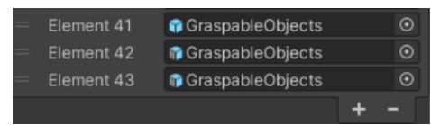

8. Click the `[Update Photon Scripts]` button attached to the PunLauncher. This updates the list of objects that should be synchronized. The number of RoomObjects increases, automatically capturing movable objects (objects with Rigidbody) such as grasp targets and drawers.

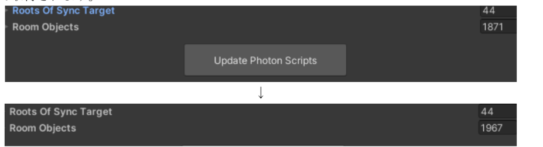

9. Verify that the PhotonTransformView script is attached. Ensure that the PhotonTransformView script is attached to all graspable objects under GraspableObjects.

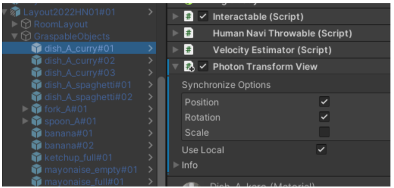

10. Verify that the PhotonView script is attached to GraspableObjects. The Observable Search automatically adds grasp target objects.
11. Use the production Unity scene to verify the operation of all created tasks. Since this is for production verification, perform the operation check with the built executable file, not within the Unity Editor. Use the configuration file (`HumanNaviConfig.json`) that includes the created tasks. For information on building and creating the configuration file, refer to the "How to Create Production Executable Files" document. Since it's the Cloud version, you need to launch two executable files, one for VR and one for ROS. For details, refer to the [README](https://github.com/RoboCupatHomeSim/human-navigation-cloud-unity). Run the [sample ROS node](https://github.com/RoboCupatHomeSim/human-navigation-ros#how-to-execute-sample-ros-node) on the ROS side. It's okay to perform operation verification on a single PC (running ROS side on VMware and launching two executables on a Windows PC), but preferably use AWS to conduct operation verification similarly to the actual competition. Check if the tasks can be cleared normally and also verify if the layout itself is normal, including unrelated object grasping and cabinet opening and closing. Also, specific to Photon, ensure that the movements of grasped objects and drawers are synchronized between the server side and the client side.
