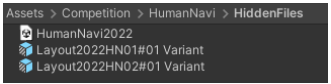
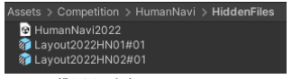
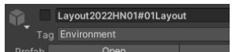
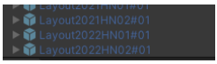
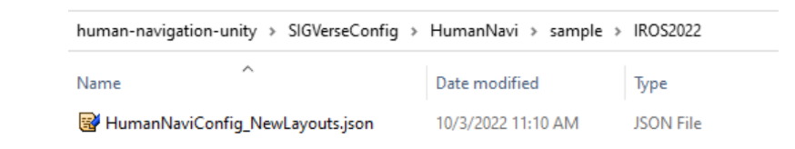
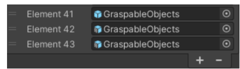
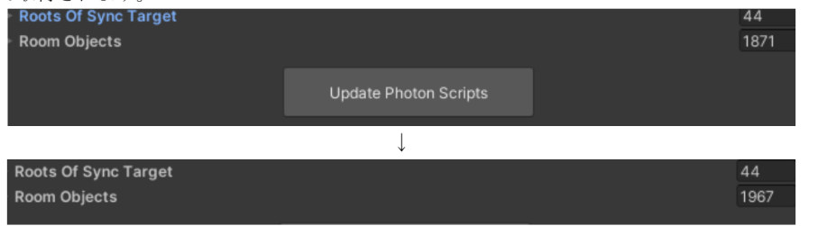

[日本語](./make_task_ja.md) | [English](./make_task_en.md)

# 競技課題作成手順

公平性の観点から，競技で使用する問題の一部を各チームで作成していただきます．
問題作成手順は以下の各競技の問題作成手順からご確認ください．

HandymanとInteractive Cleanupの課題作成方法については，動画でも説明しておりますので，こちらから確認ください．

[課題作成手順動画](https://youtu.be/JrrpMxX3Vh8)

## 問題説明用スプレッドシート
以下のテンプレート（Googleスプレッドシート）を複製し、作成した課題の説明資料を作成してください。確認作業や本番での解説などで利用します。
- [Handyman Task Description Template](https://docs.google.com/spreadsheets/d/1mMqzx-0CZG0YOU-FLNQnZLh0BB7g3noFKtWkBDInizA/edit?usp=sharing)
- [InteractiveCleanup Task Description Template](https://docs.google.com/spreadsheets/d/1-ZKrXuRVkZL1UqjX_ld2nFJ09bWUW1WfOwaq7lt5qFg/edit?usp=sharing)
- [Human_Navigation Task Description Template](https://docs.google.com/spreadsheets/d/1SK99wUuujxUdwD_PsWOkBpM4jD_pY_QRzsUibcTXRNU/edit?usp=sharing)

# Handymanの競技問題作成

基本的な課題作成の流れについては，GitHub の [Readme](https://github.com/RoboCupatHomeSim/handyman-unity) と [Wiki](https://github.com/RoboCupatHomeSim/handyman-unity/wiki/AdvancedExecutionProcedures#how-to-create-the-environmentinfoxxjson) を参考にしてください．
作成したレイアウトが適切であるか以下の手順で確認してください．

## 難易度調整について
- 課題の難易度は，原則として易しいものを意識します．
- 試行間の難易度差を十分に設けてください．現状，易しいものが多いため，特に問題はありません．
- 難易度に影響する要素:
  - 部屋の広さ
  - 通路の狭さ
  - 動的障害物アバター(EthanWoman)の存在
  - 移動距離の長さ
  - 物体が多い間取り
  - 把持対象がa-likeオブジェクトである場合
  - 指示者(Ethan)の移動
  - 把持対象の移動先が移動可能家具(ゴミ箱など)の場合
  - タスクメッセージに位置関係を表現する単語が含まれる場合
  - タスクメッセージに矛盾が含まれている場合
  - 把持対象が倒れている場合
- 現状，未知環境は設けず，全て事前に公開します．

## 課題の作成手順

「Handyman Task Description Template」というGoogleスプレッドシートに課題内容シートを追加しながら進めます．こちらのスプレッドシートも作成しながら作業を行ってください．

[テンプレートはこちら](#問題説明用スプレッドシート)

### テンプレシートの準備
- Handyman課題メモにある以下のテンプレシートをコピーして課題シートを作成します。
  - **テンプレシートまとめ（2023/05/15現在）:**
    - テンプレ2019HM01
    - テンプレ2019HM02
    - テンプレ2020HM01
    - テンプレ2021HM01
  - 各テンプレシートはレイアウトが異なります。
  - テンプレシート名は、「チーム名 + 課題番号 + 大会名」など、わかりやすい名前に変更します。例: InamuraLab_01_JapanOpen2023

### 課題シートの編集
- 課題を考え、シートの図やタスク文章を修正します。
  - 把持対象や届け先が一意に定まるタスク文章に注意してください。
  - タスク文章は150文字程度に抑えるようにします。
  - タスク文章の部屋名は、把持対象が置かれている部屋の名前にします。
  - 部屋名と使用可能な前置詞の最新情報は、「Object Label List」スプレッドシートを参照してください。

### Unityでの作業
- Unityの競技シーン（Handyman.unity）をコピーし、課題作成用シーンを作成します。
  - 課題作成用シーンは`Assets/AssetStoreTools`フォルダに保存します。このフォルダはGitHubに誤ってPushされないようにgitignore設定されています。
- Unityで課題作成用シーンを開き、Wikiの手順を参考にしながらタスクを作成します。
  - 必要に応じて、ゴミ箱やGraspingCandidatesPositionXXを微調整します。

### 課題の動作確認
- Handyman.unity をコピーして本番用Unityシーンを`Hidden`フォルダ配下に作成し、全課題の動作確認を行います。

### 課題の提出
- 課題を管理する人（例: admin）に提出する必要がある場合は、作成した課題のテンプレシートと`AvatarMotionsXX.dat`、`EnvironmentInfoXX.json`を準備し、確認後に指定された方法で提出します。

### 3Dモデル一覧（Object Labelリスト）の更新
- 各競技で使用する3Dモデル一覧は、事前に共有される「Object Label」スプレッドシートで管理します。
  - 新しいa-likeオブジェクトを追加したり、3Dモデルの扱いを変更する場合は、このリストを更新します。

 
 

# Interactive Cleanupの課題作成手順

基本的な課題作成の流れについては，GitHub の [Readme](https://github.com/RoboCupatHomeSim/interactive-cleanup-unity) と [Wiki](https://github.com/RoboCupatHomeSim/interactive-cleanup-unity/wiki/AdvancedExecutionProcedures#generate-the-competition-data-using-oculus-quest-2) を参考にしてください．
作成したレイアウトが適切であるか以下の手順で確認してください．

## 難易度調整について

課題作成の前に，課題の難易度調整に関わる項目について事前に目を通してください．

- 現状，難易度は易しくすることを意識します．
- 基本的には指差し動作で難易度をコントロールします．
- 試行間の難易度差を十分に設けます．
  - 現状，難易度は易しいものばかりで問題ありません．
- アバターが移動すればするほど，難易度が高くなります．
  - 現状，移動距離は短いものばかりで問題ありません．
- アバターの移動速度が速いほど，難易度が高くなります．
  - 現状，移動速度はデフォルト(低速)固定とします．
    移動速度を変えたい場合は，Moderator/Ethanにアタッチされている`SimpleHumanVRController.cs` の `Move Speed By Controller`の値を変えます．0.2で普通，0.25で速いものとします．
- 机や棚に置く把持可能物体は1つまでとします．1つの机に2つの物体は置きません．
- 多くの物体がデフォルトで床に置かれますが，邪魔物体は難易度が高いので，基本的には邪魔にならない位置に移動してください．
- 指差し時間が短いほど，難易度が高くなります．
  指差し時間は大体 6秒~10秒程度とします．例えば10秒の場合，5秒指差し形状を維持したあとに指差し命令を送信し，更に5秒指差し形状を維持します．
- 遠くのものを指差すほど，難易度が高くなります．
- ロボットに背を向けた指差しは，難易度が高くなります．
  - 難易度が高いため，現状極端に背を向けた指差し課題は作成しないこととします．
- 指差し時に肘を曲げるほど難易度が高くなります．
  - 現状，腕はなるべく真っ直ぐ伸ばすものとします．

### 補足

- 床に置かれた把持対象はレーザーレンジファインダーで検出できない高さのものが殆どです．

## 課題の作成手順

「InteractiveCleanup Task Description Template」というGoogleスプレッドシートに課題内容シートを追加しながら課題ファイルを作成していきます．こちらのスプレッドシートも作成しながら作業を行ってください．

[テンプレートはこちら](#問題説明用スプレッドシート)

### 課題シートの準備
- 「テンプレート」シートをコピーして課題シートを作成します。
- コピーした課題シートをわかりやすい名前に変更します。例: 「チーム名 + 課題番号 + 大会名」（例：InamuraLab_01_JapanOpen2023）

### 課題内容の編集
- 課題内容を考え、課題シートの図を修正します。
  - 把持対象（青丸）と宛先（赤丸）は必須です。
  - 移動しない場合は矢印は不要です。
  - 邪魔物体（ピンク丸）は基本的に不要です。難易度を上げたい場合は把持可能物体を邪魔物体として床に置きます。

### Unityでの作業
- Unityで競技シーンをコピーし、課題作成用シーンを作成します。
  - 課題作成用シーンは`Assets/AssetStoreTools`フォルダに入れてください。このフォルダはgitignore設定されています。
- Unityで課題作成用シーンを開き、把持候補位置オブジェクト（白いキューブ）を移動します。
  - 把持候補位置オブジェクトは、例えば`Layout2019IC01/GraspingCandidatesPositions/GraspingCandidatesPositionXX`のようなオブジェクトです。
  - 把持候補位置オブジェクトの１つは把持対象（青丸）の位置に、残り13個は全て少しでも移動させてください。

### VRデバイスの設定とデータ生成
- VRデバイスをPCに接続し、SteamVRやOculusソフトウェアを起動して、使用可能な状態にします。
- Unity Editorで「XR Plug-in Management」を設定し、データ生成モード（executionMode = 1）でInteractive Cleanupを起動し、指差し動作生成を行います。

### 課題の動作確認と提出
- 通常モード（executionMode = 0）でInteractive Cleanupを起動し、課題内容が適切か確認し、把持対象名をメモします。
- 課題管理者に提出する必要がある場合は、課題のテンプレシートと`AvatarMotionsXX.dat`、`EnvironmentInfoXX.json`を準備して提出します。

### 3Dモデル一覧（Object Labelリスト）の更新
- 各競技で使用する3Dモデル一覧は、事前に共有される「Object Label」スプレッドシートで管理します。
  - 新しいa-likeオブジェクトを追加したり、3Dモデルの扱いを変更する場合は、このリストを更新します。

  

# Human Navigation 課題作成手順

## 基本的な課題作成の流れ

基本的な課題作成の流れについては，GitHub の [Readme](https://github.com/RoboCupatHomeSim/human-navigation-unity) と [Wiki](https://github.com/RoboCupatHomeSim/human-navigation-unity/wiki/AdvancedExecutionProcedures#how-to-create-new-environments) を参考にしてください．
作成したレイアウトが適切であるか以下の手順で確認してください．

## 難易度調整について

課題作成の前に，課題の難易度調整に関わる項目について事前に目を通してください．

- 現状，難易度は易しくすることを意識します．
- 試行間の難易度差を十分に設けます．
- 部屋が広いと難易度が高くなります．
- 把持可能物体が多いと難易度が高くなります．
- 把持対象の位置を説明するためのランドマークとなり得る物体が少ないと難易度が高くなります．
- 基本的に人間でも説明が難しいような課題は難易度が高くなります．

課題の難易度は，主に以下の要素によって調整されます：

1. **部屋の広さ：** 広い部屋はナビゲーションの難易度を高めます．
2. **把持可能物体の数：** 物体が多いと，特定の目的物を見つけるのが難しくなります．
3. **ランドマーク物体の数：** 目的地や目的物の位置を説明するためのランドマーク物体が少ないと，ナビゲーションが難しくなります．
4. **課題の説明の難易度：** 人間が理解しにくい説明は，難易度が高いと考えられます．

課題作成時はこれらの要素を考慮し，参加者が解決可能なレベルに調整することが重要です．

## 課題の作成手順

1. 「HumanNavigation Task Description Template」というGoogleスプレッドシートに課題内容シートを追加しながら課題ファイルを作成していきます．こちらのスプレッドも開きながら作業を行ってください．

      [テンプレートはこちら](#問題説明用スプレッドシート)

   1. 課題を考えます．新規問題と過去問の比率を決め，新規問題に関しては新しくレイアウトを作成します．新しいレイアウトからは2題出題します．つまり新規問題を4問作成する場合は，新規レイアウトを2つ作成します．(2022年時点)この時点ではどのようなレイアウトにするか構想を考えるだけです．
   2. 通常の[HumanNavi](https://github.com/RoboCupatHomeSim/human-navigation-unity)(Cloud版ではない方)をUnityエディタで開きます．
   3. Unityで競技シーン(HumanNavi.unity)をコピーし，課題作成用シーンを作成します．名前はHumanNavi2022.unityなどとします．課題作成用シーンは Assets/Competition/HumanNavi/HiddenFiles フォルダに入れてください．HiddenFiles フォルダは gitignore 設定されているので間違ってGitHubにPushされることを防ぎます．HiddenFiles フォルダが無い場合は作成してください．
   

   4. Unityで課題作成用シーンを開き，Wiki手順を参考に課題を作成します．HumanNavigationTask Templateの「課題作成」シートの注意事項なども参考にしてください．レイアウトの作成(家具，把持可能物体の配置)及び宛先の作成を行います．
   5. レイアウト確認用のダミーの宛先を作成します．参加者には事前にレイアウトを通知しますが，レイアウトを確認するときに使用するダミーの宛先を作成します．ダミーの宛先はdestination#00という名前でヒューマンアバターの足元に配置します．既存レイアウトのものをコピーして作成してください．
   6. テンプレシートをコピーして課題シートを作成します．今までの課題の過去問シートもあります．新レイアウトの画像はUnity画面をスクショしてください．
   7. 動作確認用のコンフィグファイル(HumanNaviConfig.json)を作成します．前回のコンフィグファイルを参考に修正すると楽です．コンフィグファイルの仕様はWikiを参照してください．
   8. 課題作成用シーンを実行して，出題予定の新規問題・過去問の動作確認を行います．ROS側は[サンプルのROSノード](https://github.com/RoboCupatHomeSim/human-navigation-ros#how-to-execute-sample-ros-node)を起動します．課題が正常にクリアできるか確認するほか，無関係の物体の把持や戸棚の開閉などレイアウト自体が正常かどうかも確認してください．
   9. 新レイアウトのPrefabを作成します．少々複雑です．Prefabは以下の2種類作成します．
      - 正解destination#XXを取り除いたPrefab
        - 名前はLayout2022HN01#01Layoutなど
        - 競技前に公開する
      - 上記+正解destination#XXを包含したPrefab
        - 名前はLayout2022HN01#01など
        - 競技終了後に公開する

      つまりネスト状のPrefabを作成することになります．正解destination#XXは公開できないため，レイアウトを公開する場合には1つ目のPrefabのみをGitHubなどで公開します．競技に使用するのは2つ目のPrefabです．2つ目のPrefabは競技終了後に公開します．2種のPrefabの作成方法は以下です．

      - Assets/Competition/HumanNaviの下に今回用のフォルダを作成します．名前はAssets/Competition/HumanNavi/IROS2022など．

      - レイアウト(Layout2022HN01#01など)から一時的にdestination#00以外のdestination#XXを全て除外(シーンのルートに移動)します．
      

      - レイアウト(Layout2022HN01#01など)を，今回用のフォルダの下にドラッグ&ドロップすることによりレイアウトのPrefabを作成します．
      

      - 作成したPrefabの名前に”Layout”を追加します．
      

      - destination#XXを元の位置に戻します．
      

      - レイアウト(Layout2022HN01#01など)を，HiddenFilesフォルダの下にドラッグ&ドロップすることによりレイアウトのPrefabを作成します．※[Create Prefab or Variant?]ウィンドウでは，[Prefab Variant]を選択します．
      

      - 作成したPrefab Variantの名前から”Variant”を削除します．
      

      - 全てのレイアウトについて繰り返します．

        
   10. unitypackageをエクスポートします．[Assets]-[Export Package...] をクリックし，作成したPrefabを選択してエクスポートします．
   

   11. 成果物をまとめます．成果物は，HumanNavigationTask Templateの課題シート，新レイアウトを含んだunitypackageファイル，コンフィグファイルです．

## 全課題の取りまとめ

- 前述の手順で個別に作成された，課題シート，新レイアウトを含んだunitypackageファイル，コンフィグファイルをまとめて管理します．
  1. 課題を回収します．参加チームに作成してもらった課題など全ての課題を回収します．課題シート，新レイアウトを含んだunitypackageファイル，コンフィグファイルです．
  2. 課題シートを1つのGoogleスプレッドシートにまとめます．
  3. 1つのコンフィグファイルに作成した全てのタスクをまとめます．
  4. 通常のHumanNavi(Cloud版ではない方)をUnityエディタで開きます．
  5. Unityで競技シーン(HumanNavi.unity)をコピーし，課題作成用シーンを作成します．名前はHumanNavi2022.unityなどとします．課題作成用シーンは Assets/Competition/HumanNavi/HiddenFiles フォルダに入れてください．HiddenFiles フォルダは gitignore 設定されているので間違ってGitHubにPushされることを防ぎます．HiddenFiles フォルダが無い場合は作成してください．
  6. 課題作成用シーンを開きます．
  7. 新レイアウトを含んだunitypackageファイルをインポートします．インポートは[Assets]-[Import Package]-[Custom Package...]から可能です．全ての新レイアウトに関して繰り返します．
  8. 課題作成用シーンに新レイアウトを追加します．シーンに新レイアウトPrefabをドラッグ&ドロップで追加します．HiddenFiles配下のPrefab(destination#XXを含んでいるもの)です．
  9. Moderatorにアタッチされている HumanNaviSessionManager のEnvironments に新レイアウトを追加します．Environmentsのサイズを追加するレイアウト数だけ大きくし，Elementに新レイアウトを全て追加します．
  

  10. 課題作成用シーンを実行して，出題予定の新規問題・過去問の動作確認を行います．ROS側は[サンプルのROSノード](https://github.com/RoboCupatHomeSim/human-navigation-ros#how-to-execute-sample-ros-node)を起動します．課題が正常にクリアできるか確認するほか，無関係の物体の把持や戸棚の開閉などレイアウト自体が正常かどうかも確認してください．

## レイアウト確認用Unityシーンの作成

参加者が新レイアウトを確認するためのレイアウト確認用Unityシーンを作成します．正解のdestination#XXは含めてはいけません．

1. 通常のHumanNavi(Cloud版ではない方)をUnityエディタで開きます．
2. Unityで競技シーン(HumanNavi.unity)をコピーし，レイアウト確認用シーンを作成します．名前は`HumanNavi2022Layout.unity`などとします．レイアウト用シーンは今回用フォルダ(`Assets/Competition/HumanNavi/IROS2022`など)に入れてください．

3. レイアウト確認用シーンを開きます．
4. 正解destination#XXを取り除いたPrefab(`Layout2022HN01#01Layout`など)をシーン中に置きます．

5. 追加したレイアウトのルートのGameObjectが有効になっている場合は，Inspectorからチェックを外します．

6. 追加したレイアウトの名前の末尾の"Layout"を削除します．

7. 念のため宛先は`destination#00`だけであることを追加した全てのレイアウトで確認します．

8. Moderatorにアタッチされている `HumanNaviSessionManager` のEnvironments に新レイアウトを追加します．Environmentsのサイズを追加するレイアウト数だけ大きくし，Elementに新レイアウトを全て追加します．

9. レイアウト確認用のコンフィグファイル(`HumanNaviConfig.json`)を作成します．
   - `sessionTimeLimit`は，999
   - `recoverUsingScoreFile`は，false
   - `maxNumberOfTrials`は，新レイアウト数(課題数ではない)
   - `taskInfoList`には，新レイアウト情報を記載する．targetはダミーなので適当にレイアウトに存在するGraspableObjectsの中の一番上のオブジェクトを記載し，destinationは`destination#01`固定．この時点では`destination#01`です．`#00`ではありません．

10. レイアウト確認用シーンを実行してエラーが発生することを確認します．ROS側は[サンプルのROSノード](https://github.com/RoboCupatHomeSim/human-navigation-ros#how-to-execute-sample-ros-node)を起動します．`destination#01`は存在しないはずなので，エラーが出るはずです．
11. レイアウト確認用のコンフィグファイルを修正します．宛先を`destination#00`にします．

12. レイアウト確認用シーンを実行して動作確認を行います．ROS側はサンプルのROSノードを起動します．物体の把持や戸棚の開閉などレイアウト自体が想定通りか確認してください．
13. (時期が来たら)レイアウト確認用のUnityファイルをGitHubなどで公開します．新レイアウトは公開するタイミングが決まっているので時期が来たら公開します．公開するものは以下のファイルです．
    - 今回用フォルダ(`Assets/Competition/HumanNavi/IROS2022`など)
    - レイアウト確認用コンフィグファイル．コンフィグファイルは，`HumanNaviConfig_NewLayouts.json`にリネームし，コンフィグファイルの今回用フォルダ(`SIGVerseConfig/HumanNavi/sample/IROS2022`など)に入れます．
    

## 課題の動作確認

1. 本番で使用するCloud版の[HumanNavi](https://github.com/RoboCupatHomeSim/human-navigation-cloud-unity)をUnityエディタで開きます．
2. 前述の手順で作成したunitypackageファイル(全ての新レイアウトを含んだもの)をインポートします．本番用のPrefab及びレイアウト確認用のPrefabが入っています．インポートは`[Assets]-[Import Package]-[Custom Package...]`から可能です．
3. `HumanNavi.unity` をコピーして本番用Unityシーンを作成します．名前は`HumanNavi2022.unity`などとします．本番用シーンは `Assets/Competition/HumanNavi/HiddenFiles` フォルダに入れてください．`HiddenFiles` フォルダは gitignore 設定されているので間違ってGitHubにPushされることを防ぎます．
4. 本番用シーンを開きます．
5. 本番用シーンに新レイアウトを追加します．シーンに新レイアウトPrefabをドラッグ&ドロップで追加します．`HiddenFiles`配下の本番用Prefab(destination#XXを含んでいるもの)です．

6. Moderatorにアタッチされている `HumanNaviSessionManager` のEnvironments に新レイアウトを追加します．Environmentsのサイズを追加するレイアウト数だけ大きくし，Elementに新レイアウトを全て追加します．
7. PunLauncherにアタッチされている `PunLauncher` の`RootsOfSyncTarget` に新レイアウトのGraspablesを追加します．Cloud版にはPhotonの機能を追加するため追加の手順が幾つかあります．`RootsOfSyncTarget`のサイズを追加するレイアウト数だけ大きくし，Elementに新レイアウトの下のGraspablesオブジェクトを追加します．

8. PunLauncherにアタッチされている `PunLauncher`の `[Update Photon Scripts]` ボタンをクリックします．これにより同期すべきオブジェクト一覧が更新されます．RoomObjectsの数が増えていることが分かります．把持対象や引き出しなど動く物体(Rigidbodyが付いている物体)が自動で取得されます．

9. PhotonTransformViewスクリプトがアタッチされていることを確認します．GraspableObjectsの下にある全ての把持可能オブジェクトに対してPhotonTransformViewスクリプトがアタッチされていることを確認してください．

10. GraspableObjectsにPhotonViewスクリプトがアタッチされていることを確認します．Observable Searchには把持対象オブジェクトが自動追加されています．
11. 本番用Unityシーンを使用して，作成した全課題の動作確認を行います．本番用の確認なのでUnityエディタ上ではなく，ビルドした実行ファイルで動作確認を行ってください．コンフィグファイル(`HumanNaviConfig.json`)は作成した課題を含んだものを使用してください．ビルドやコンフィグファイルの作成に関しては資料「本番用実行ファイルの作成方法」を参照してください．Cloud版なのでVR側とROS側の2つの実行ファイルを起動する必要があります．詳細は[README](https://github.com/RoboCupatHomeSim/human-navigation-cloud-unity)を確認してください．ROS側は[サンプルのROSノード](https://github.com/RoboCupatHomeSim/human-navigation-ros#how-to-execute-sample-ros-node)を起動します．1つのPC上で動作確認してもいいですが(ROS側はVMwareで実行してWindows PC上で実行ファイルを2つ起動する)，なるべくAWSを使用して本番同様に動作確認を行ってください．課題が正常にクリアできるか確認するほか，無関係の物体の把持や戸棚の開閉などレイアウト自体が正常かどうかも確認してください．またPhoton特有の確認内容として把持物体や引き出しの動きがサーバ側とクライアント側で同期が取れていることも確認してください．
